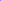

Node.js 애플리케이션을 디버깅하는 방법을 정리한다.<br/>
레거시 콘텐츠와 동일한 형식의 픽스처 — 비표준 날짜(월 한 자리), 인라인 HTML, 레거시 이미지 상대 경로를 포함한다.



## 인스펙터 사용

| 플래그 | 설명 |
| --- | --- |
| `--inspect` | 디버거 프로토콜 활성화 |
| `--inspect-brk` | 첫 줄에서 중단 |

```bash
node --inspect-brk app.js
```
