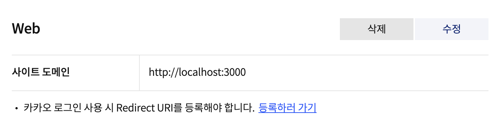

## 시작하기

1. [카카오 개발자 사이트](https://developers.kakao.com/)에 로그인한다.
2. 로그인 후 앱키(자바스크립트)를 발급받는다.
3. WEB 플랫폼에서 사이트 도메인을 등록한다.

   

## Next.js에 적용하기

```jsx
import React, { useEffect } from 'react';
import Head from 'next/head';
import styles from './styles.module.css';
import infoData from '@public/assets/infoData.json';

export const Map: React.FC = () => {
  const kakaoMap = React.useRef<HTMLDivElement>(null);

  useEffect(() => {
    if (kakaoMap && kakaoMap.current) {
      const x = 126.570667;
      const y = 33.450701;
      const coords = new (window as any).kakao.maps.LatLng(y, x); // 지도의 중심좌표
      const options = {
        center: coords,
        level: 2,
      };
      const map = new (window as any).kakao.maps.Map(kakaoMap.current, options);
      const geocoder = new (window as any).kakao.maps.services.Geocoder();
      // 주소로 좌표를 검색합니다
      geocoder.addressSearch(infoData.address, function (result: any, status: any) {
        // 정상적으로 검색이 완료됐으면
        if (status === (window as any).kakao.maps.services.Status.OK) {
          const coords = new (window as any).kakao.maps.LatLng(result[0].y, result[0].x);

          // 결과값으로 받은 위치를 마커로 표시합니다
          const marker = new (window as any).kakao.maps.Marker({
            map: map,
            position: coords,
          });

          // 인포윈도우로 장소에 대한 설명을 표시합니다
          const infowindow = new (window as any).kakao.maps.InfoWindow({
            content: '<div style="width:150px;text-align:center;padding:6px 0;">서울일삼</div>',
          });
          infowindow.open(map, marker);

          // 지도의 중심을 결과값으로 받은 위치로 이동시킵니다
          map.setCenter(coords);

          // 일반 지도와 스카이뷰로 지도 타입을 전환할 수 있는 지도타입 컨트롤을 생성합니다
          const mapTypeControl = new (window as any).kakao.maps.MapTypeControl();

          // 지도에 컨트롤을 추가해야 지도위에 표시됩니다
          // kakao.maps.ControlPosition은 컨트롤이 표시될 위치를 정의하는데 TOPRIGHT는 오른쪽 위를 의미합니다
          map.addControl(mapTypeControl, (window as any).kakao.maps.ControlPosition.TOPRIGHT);

          // 지도 확대 축소를 제어할 수 있는  줌 컨트롤을 생성합니다
          const zoomControl = new (window as any).kakao.maps.ZoomControl();
          map.addControl(zoomControl, (window as any).kakao.maps.ControlPosition.RIGHT);
        }
      });
    }
  }, [kakaoMap]);

  return (
    <>
      <Head>
        <script
          type="text/javascript"
          src={`//dapi.kakao.com/v2/maps/sdk.js?appkey=${process.env.KAKAO_API}&libraries=services`}
        />
      </Head>
      <div className={styles.map}>
        <h1 className={styles.title}>찾아오시는 길</h1>
        <div
          id="map"
          className={styles.kakaoMap}
          ref={kakaoMap}
          style={{ width: '100%', height: '20rem' }}
        ></div>
      </div>
    </>
  );
};
```
