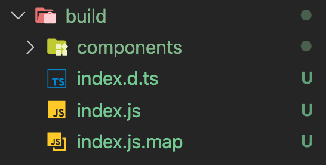
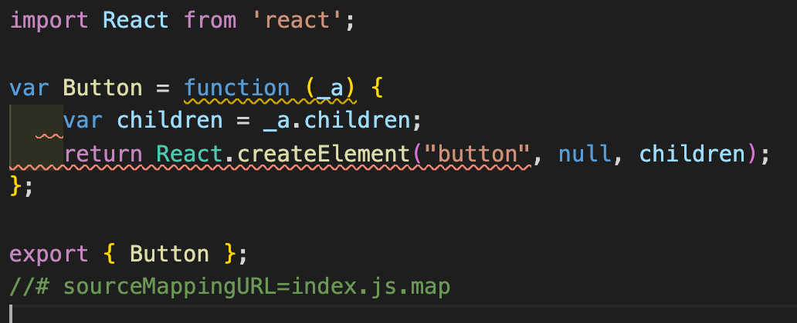
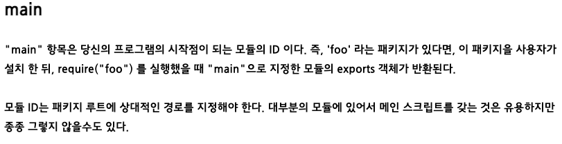
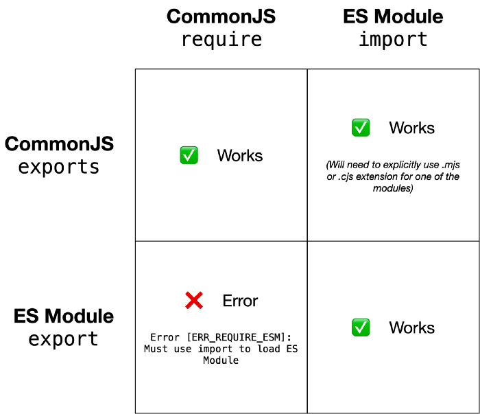
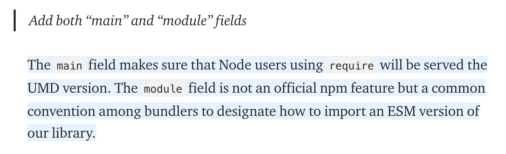

## 개요

언젠가 한번 나만의 라이브러리를 만들어서 배포해보고 싶다는 생각을 갖구있다가 이번에 디자인시스템 개발을 도전하게 되었다. 리액트 컴포넌트 기반으로 디자인시스템 개발에 대한 자료를 찾아보다가 `Typescript` + `Storybook` + `React` 을 활용하여 개발을 진행하고 웹팩대신 `Rollup` 이용해서 빌드하여 npm으로 배포를 한다는 블로그 글들을 많이 찾게 되었고 도전해보기로 했다

## Rollup ?

`Typescript` , `Storybook` 그리고 `React` 요것들(?)은 뭐 기존에 프론트 개발을 하면서 많이 사용해봐서 알겠는데 웹팩 말고 Rollup? 이건 뭐하는거지?? 내가 아는 번들러라고는 웹팩이 유일무이했는데 Rollup이란게 있다고?

라이브러리를 배포하려면, 보통 webpack 과 같은 도구로 라이브러리도 번들링을 해주어야 한다. 번들링은 필수는 아니며 TypeScript 또는 Babel로 코드를 트랜스파일해서 등록을 할 수도 있다.

그럼 번들링 도구로 webpack을 쓸 수도 있는데 Rollup을 쓰는 이유는 뭘까?

webpack은 ES Module 형태로 번들을 할 수 없다. webpack을 사용 할 때에는 일반적으로 commonjs 형태로 번들링을 하게 되는데, commonjs로 번들링한 라이브러리를 나중에 다른 프로젝트에서 사용하게 되면 Tree-Shaking 을 지원하지 않는다고 한다.

그럼 또 Tree-Shaking은 뭐지???

<aside>
💡 배포한 라이브러리를 설치하고 그 중에서 Button 컴포넌트만 사용한다고 할 때, Tree-shaking이 되었다면 프로젝트를 빌드할 때, Button 컴포넌트 외에 다른 컴포넌트를 사용하지 않았기 때문에 빌드된 파일에도 다른 컴포넌트와 관련된 코드가 포함되지 않게 된다. 즉, 사용한 컴포넌트만 코드에 포함된다고 한다.

</aside>

<br/>

🚀 **참고**

[(Webpack 2) 트리 쉐이킹을 해보자!](https://perfectacle.github.io/2017/03/12/webpack2-tree-shaking/)

오.... 그럼 ES Module 형태로 배포하는게 좋은건가보네?

## 시작하기

```jsx
// rollup.config.js
output: [
    {
      file: 'build/index.js',
      format: 'es',
      sourcemap: true,
      exports: 'named',
    },
  ],
```

rollup.config.js에 output에 format을 'es'로 설정해주면 ES Module 형태로 번들링해준다.



<br/>
빌드를 해주면 `export`를 사용해서 위와 같이 내가 만든 Button 컴포넌트를 내보낸다.

이제 `npm publish` 이용해서 배포를 해보고 CRA(create-react-app) CNA(create-next-app)을 이용해서 프로젝트를 생성하고 내가 만들어서 배포한 라이브러리를 설치해서 Button 컴포넌트를 제대로 불러오는지 실험해보았다. `Unexpected token 'export'...` 에러가 발생했다...😇

뭔데... 왜 안되는데 문제 있는거 아니야?? 뭐 설정을 잘못했나? 뭐가 문제인데?? 흠...

흠... 뭐지? 내가 설정을 잘못했나?싶어 여러 다른 라이브러리를 찾아보던 중 `[class101 ui](https://ui.class101.dev/)` 라는 **클래스101** 에서 사용하는지는 잘 모르겠지만 클래스101에서 개발한 디자인시스템이 rollup으로 빌드를 해서 배포한 것이라 동일하게 CRA와 CNA 프로젝트에 설치하여 컴포넌트를 불러온 결과는 역시 똑같다...

그럼 다른 라이브러리는 괜찮나? 싶어 `Antd` 와 `Material-ui` 를 설치해서 실험해보도록 했다.

실험 결과, 모두 정상 동작한다. 역시 유명 라이브러리는 다르네...

이후 계속 다른 블로그들을 찾아보며 여러 설정을 바꿔보면서 파악한 결과, `ES Module`로 빌드하여 배포한 것은 CNA에서 이상하게도 에러를 뱉어내고 `CommonJS` 형태로 빌드한 것은 잘 동작하는 것을 실험을 통해 알게 됨.

흠... 그럼 유명 라이브러리랑 내가 배포한 라이브러리랑 차이는 뭔데...?

차이를 알아보고자 삽질을 해보도록 했다. 해당 라이브러리를 뜯어보고 또 평소에는 그냥 모르고 지나쳤던 node의 package 관리에 대해 정보를 찾아보며 무엇을 잘못했나에 대해 찾아보았다.

여러 라이브러리 배포에 대해 포스팅한 블로그를 살펴보았고 , 그 중 rollup으로 배포를 시도한 몇몇 포스팅에서 ejs와 cjs 모두 빌드하고 package.json에 main은 cjs의 경로를 module은 ejs의 경로를 지정하는 것을 발견하였다.

뭐지? 둘중 하나도 아니고 둘다 빌드를 한다고? 흠... 그럼 자동으로 ESModule 프로젝트이면 ejs로 빌드된 코드를 가져오고, CommonJS 프로젝트에서는 cjs 코드를 가져온다는 의미인가? 어떻게 동작하는 거지???

라는 궁금증이 생겼다. 뭔가 하나를 알려고 팠더니 파도파도 계속 궁금한게 늘어만 간다...☠️

먼저, package.json의 main이라는 키값에 대한 설명을 찾았다.<br/><br/>

<br/>

이처럼 package.json에서 main은 디렉토리가 위치한 엔트리 포인트를 나타낸다. 즉, 이 패키지의 메인 파일명에 대한 지정을 나타낸다. 따라서, 빌드한 파일로 떨궈진(?) index.js에 대한 경로를 적어주면, 라이브러리를 import 하거나 require 할 때, 이 main에 적혀진 파일을 참조하여 가져온다.

음...? 그럼 만약 내 프로젝트가 ES Module 로 작성된 플젝이면...?? package.json의 main에 cjs 경로 적어주고 module에 ejs 경로 적어줬으니깐 알아서 자동으로 module에 적혀있는 ejs를 가져다 쓴다는건가??

그래서 시작된 노가다...

먼저, 플젝에 `const { Button } = require('my-library')` 를 삽입하고 어떤 것을 참조하나 보았다.

당연하게도, package.json의 main에 설정해두었던 경로를 참조한다.

두 번째, package.json 에 `"type" : "module"` 로 지정하여 ES Module을 사용하는 플젝을 하나 파서 `import { Button } from 'my-library'` 해보고 어떤 것을 참조하나 보았다.

뭐지...? package.json의 module이 아니라 main인 cjs 코드 참조하네...;;

그럼 뭔데 어떻게 동작하는건데~~!!! 그리고 ES Module 플젝인데 cjs코드 가져다가 임포트시켜도 동작하네...?

계속해서 궁금증이 또 추가 되었다...

일단 알게된 ES Module과 CommonJS 차이점!<br/><br/>

<br/><br/>

[Using ES modules with CommonJS modules in Node.js](https://pencilflip.medium.com/using-es-modules-with-commonjs-modules-in-node-js-1015786dab03)<br/><br/>

아~ CommonJS는 걍 다 사용 가능하네~~

그냥 cjs로만 빌드해서 사용할까? 근데 그럼 Tree-Shaking 안된다며...?

하... 포기할까...? 하다가 끈기를 가지고 다시 도전!!!🔥

그러다 package.json의 main과 module의 차이점에 대한 포스팅 발견!!<br/><br/>

[What is the "module" package.json field for?](https://stackoverflow.com/questions/42708484/what-is-the-module-package-json-field-for)

[Code-splitting for libraries-bundling for npm with Rollup 1.0](https://levelup.gitconnected.com/code-splitting-for-libraries-bundling-for-npm-with-rollup-1-0-2522c7437697#9f6f)<br/><br/>

<br/>

아! `module`은 공식적인게 아니지만! 나중에 번들러가 참조하는거구나!!!

이제 좀 이해가 가기 시작한다...

어디서든 실행가능하도록 main은 cjs를 가리키게 하고 프로젝트 빌드할때 번들러가 `module`을 참조하는거구나~

지금까지 알아낸 결과를 정리하자면...

1. cjs로 만든 라이브러리는 프로젝트에서 import export 로 불러오고 내보내고 가능 (단, ejs로 작성된 라이브러리는 require로 못 불러낸다.)
2. 그러면 당연히 라이브러리를 만든다하면 대부분 지원되는 cjs로 배포하는게 이득인가??
3. 하지만 cjs는 트리쉐이킹이 안되자나!!!
4. 그럼 어쩌란거지???
5. 라이브러리 A를 만들 때 cjs버젼 ejs버젼 둘다 만든다. package.json에 module이라는 키 추가해서 값으로 ejs 경로 추가해줌. main은 cjs 경로 가리킴.
6. 프로젝트에 라이브러리 A를 인스톨하고 모듈들을 사용함. (import로 불러오든 require로 불러오든 상관 ㄴㄴ)
7. 프로젝트 완성후 완성한 프로젝트를 웹팩같은 번들러로 빌드를 할때 라이브러리 A의 package.json의 module을 참고해서 ejs형식을 참고하게되고 트리쉐이킹 가능해서 빌드할 때 현재 플젝에서 라이브러리 A에서 사용한 것만 긁어서 빌드한다!

끝!!!
