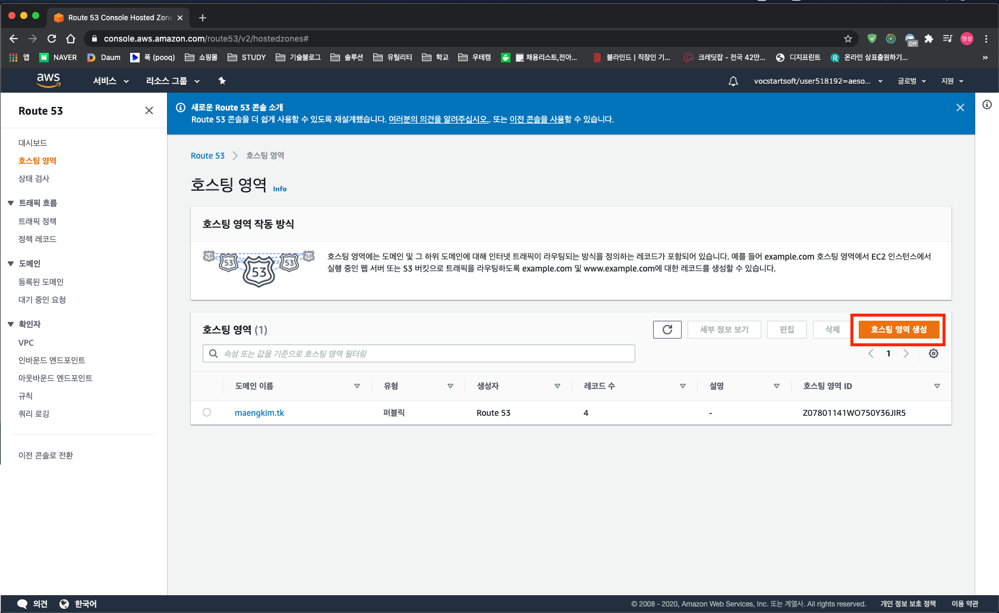
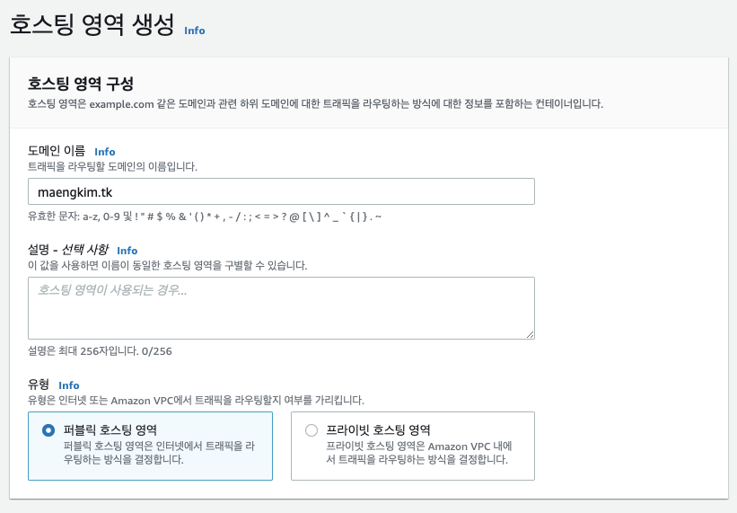
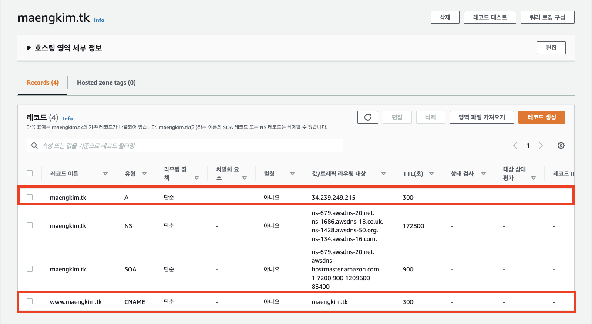

## 도메인

도메인은 사이트를 구분하는 글자입니다. 다른 사람이 당신의 사이트를 찾아가기 위해서, 도메인이라는 "인터넷 주소"가 필요합니다.

## 무료 도메인 사이트

[Freenom - A Name for Everyone](https://www.freenom.com/en/index.html?lang=en)

(.tk .ml .ga .cf .gq) 무료 도메인을 만들 수 있습니다.

## 도메인 연결

Route 53에 호스팅 영역 생성하기.

 

구매한 도메인을 입력해줍니다.

 

레코드를 생성해줍니다. 유형 A에는 인스턴스 퍼플릭 IP주소를 값으로 입력하고, 유형 CNAME에는 도메인주소를 값으로 입력합니다.

네입서버의 값을 도메인호스팅 사이트의 네임서버에 입력해줍니다.
