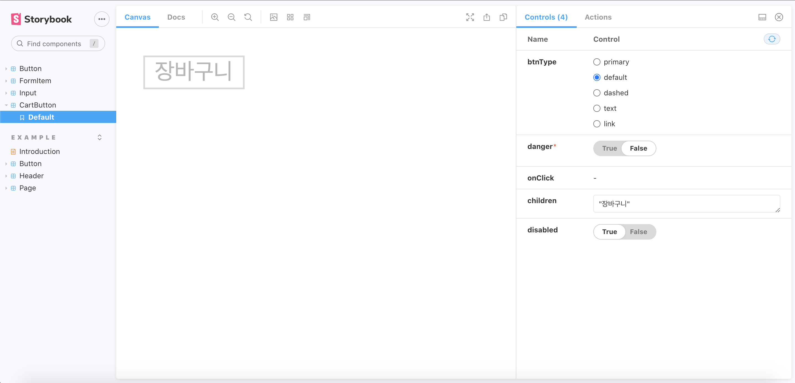

## 이슈

> 컴포넌트를 설계할 때, 필요한게 생길 때마다 해당 케이스에 맞게 컴포넌트를 설계하다 보니, 비슷한 기능을 가진 컴포넌트들이 생겨났고, 결과적으로 재활용성이 떨어졌다.

> 개발은 컴포넌트 단위로 진행하지만 실제 개발환경은 항상 페이지 단위로 만들어지기 때문에 어쩌면 당연히 일어날 수도 있지만 웹 개발에 있어서 재활용성이 떨어진다는 것은 생산성이 나빠지거나 추후에 리팩토링을 할 때, 과정이 커지고 복잡해질 가능성이 있다.

## Storybook 이란?

> 스토리북(Storybook)은 UI 컴포넌트를 위한 유저 인터페이스 개발 환경 및 자유롭게 컴포넌트를 테스트할 수 있는 도구이다. 스토리북을 활용하면 개발자는 독립적인 환경에서 UI 컴포넌트가 어떻게 실제로 렌더링되는지 직접 시각적으로 테스트하면서 개발할 수 있고, 개발환경에서 컴포넌트들을 인터랙티브하게 보여줄 수 있다.

> UI 컴포넌트를 독립적으로 개발함으로써, 컴포넌트 재사용성, 테스트, 개발 속도를 향상시킨다.

## 설치

`cd <프로젝트 디렉터리>`

`npx -p @storybook/cli sb init`

`.storybook/main.js` 에 필요한 설정 및 에드온 추가

```jsx
module.exports = {
  stories: ['../src/**/*.stories.mdx', '../src/**/*.stories.@(js|jsx|ts|tsx)'],
  addons: [
    '@storybook/addon-links',
    '@storybook/addon-essentials',
    '@storybook/preset-create-react-app',
    '@storybook/addon-docs',
    '@storybook/addon-actions',
    '@storybook/addon-viewport',
  ],
};
```

## 사용 방법

### 1. 컴포넌트 작성

```tsx
// **CartButton.tsx**
import React, { useState, useEffect } from 'react';
import { Button } from '../../components';
import { IButtonProps } from '../../interfaces';

export const CartButton: React.FC<IButtonProps> = ({ children, ...props }) => {
  const [cart, setCart] = useState<Array<number>>([]);

  const onClickHandler = (e: React.MouseEvent) => {
    e.preventDefault();
    setCart([1, ...cart]);
  };

  useEffect(() => {
    console.log(cart);
  }, [cart]);

  return (
    <Button onClick={onClickHandler} {...props}>
      {children}
    </Button>
  );
};

CartButton.defaultProps = {
  btnType: 'primary',
  children: '장바구니',
  disabled: true,
};
```

### 2. 스토리 작성

```tsx
// **CartButton.stories.tsx**
import React from 'react';
import { Story, Meta } from '@storybook/react/types-6-0';
import { action } from '@storybook/addon-actions';
import { CartButton } from './CartButton';
import { IButtonProps } from '../../interfaces';

export default {
  title: 'CartButton',
  component: CartButton,
} as Meta;

const Template: Story<IButtonProps> = (args) => <CartButton {...args} />;

export const Default = Template.bind({});
Default.args = {
  btnType: 'default',
  danger: false,
  onClick: action('onClick 이벤트'),
  children: '장바구니',
};
```

## **Storybook 실행 이미지**



## 참고

[Storybook 소개 / 기본 사용법](https://www.daleseo.com/storybook/)

[Storybook: UI component explorer for frontend developers](https://storybook.js.org/)

[TypeScript와 Storybook을 사용하여 디자인 시스템 구축하기](https://velopert.gitbook.io/storybook-tutorial/)

[실용적인 프론트엔드 테스트 전략 (2) : TOAST Meetup](https://meetup.toast.com/posts/178)

[간단한 컴포넌트 만들기](https://www.learnstorybook.com/intro-to-storybook/react/kr/simple-component/)

[UI 컴포넌트 구축하기](https://www.learnstorybook.com/design-systems-for-developers/react/kr/build/)

[스토리북에서 스토리를 작성하는 방법](https://simsimjae.tistory.com/395)
