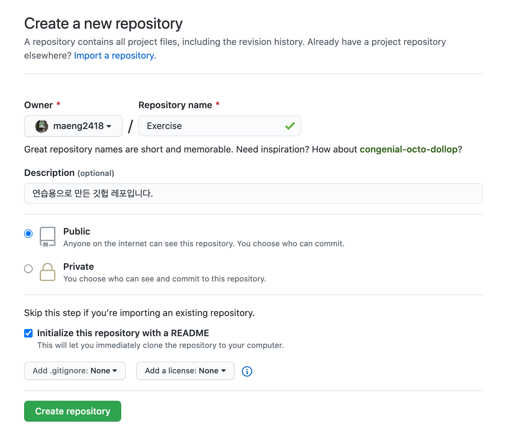
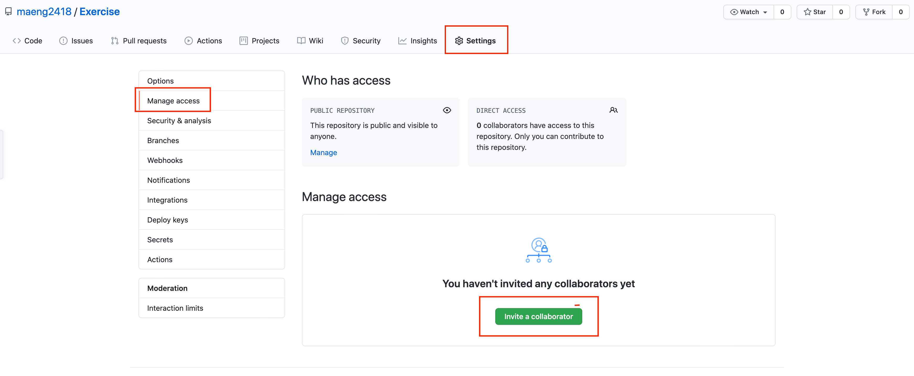
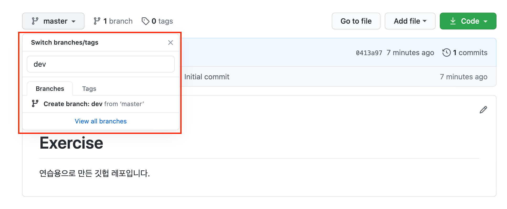
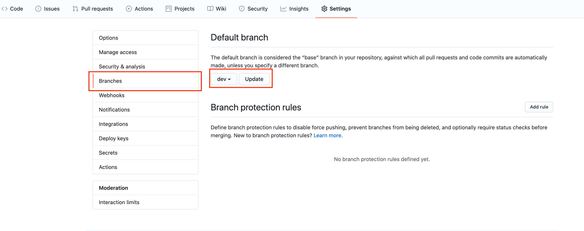

## Git? GitHub?

- Git은 소스 코드 버전 관리 및 협업을 위해 가장 많이 사용되는 VCS (Version Control System)이다.
- GitHub은 Git을 호스팅 해 주는 사이트로, '소셜 코딩'을 표방하며 가장 유명하고 널리 사용된다.

## Git 설치하기

[https://git-scm.com/downloads](https://git-scm.com/downloads) ← 설치!

## GitHub에 저장소 생성하기

## 팀원에게 편집 권한 부여하기

## 로컬에 클론만들기

`$ git clone https://github.com/maeng2418/Exercise.git`

## Develop 브랜치를 Default로 설정하기

## 버젼 **작성자 설정**

`$ git config --global user.name "자신의 닉네임"`

`$ git config --global user.email "자신의 이메일"`

버전에 포함될 버전을 만든 사람에 대한 정보를 설정합니다. 이 설정은 ~/.gitconfig 파일에 저장되고 1번만 해주면 됩니다.

## Git commit 에디터 설정

`$ git config --global core.editor "vim"`

## 작업 시나리오

1. 로컬에 클론을 받는다. (default 브랜치로 받아짐.)
2. feature 브랜치를 만든다.

   `$ git checkout -b feature/readme`

   옵션 b : 브랜치를 생성하고 바로 전환.

3. 작업을 하고 커밋을 하고 `push`를 한다.
4. github으로 가서 `pull-request`를 날린다.
5. dev에 `merge`를 시킨다.
6. 로컬에서 dev 브랜치로 전환하고 `pull`을 해서 업데이트를 한다.
7. 로컬과 원격 feature 브랜치를 삭제한다.

   `$ git branch -d B(브랜치명)`

   `$ git push origin --delete 브랜치명`

## git 명령어 정리

`$ git clone`

- 원격(remote) 저장소를 지역(local) 저장소로 복제
- 별도의 remote 설정없이 clone을 통해서 원격 저장소와 연결된다.

`$ git add <파일이름>`

- 작업공간에서 변경이 발생한 파일을 다음 커밋에 포함되도록 예약하는 것
- 파일은 스테이지 영역(stage area)에 들어가 있게 된다.

`$ git rm <파일이름>`

- git add 명령어의 반대입니다.

`$ git commit`

- 파일 및 폴더의 추가/변경 사항들에 대해 기록을 하는 것

`$ git push`

- 웹 상의 원격 저장소로 변경된 파일을 업로드하는 것

`$ git pull`

- 다른 사람의 변경사항에 대해서 내 로컬에 적용

## 훌륭한 Git 커밋 메시지의 일곱 가지 규칙

1. 제목과 본문을 빈 행으로 분리한다
2. 제목 행을 50자로 제한한다
3. 제목 행 첫 글자는 대문자로 쓴다
4. 제목 행 끝에 마침표를 넣지 않는다
5. 제목 행에 명령문을 사용한다
6. 본문을 72자 단위로 개행한다
7. 어떻게 보다는 무엇과 왜를 설명한다

- **자주 사용하는 타입명**
  - `docs` : 문서와 관련된 커밋입니다.
  - `feat` : 기능 개발과 관련된 커밋입니다.
  - `style` : 스타일링과 관련된 커밋입니다.
  - `refactor` : 코드 리팩토링과 관련된 커밋입니다.
  - `fix` : 버그 해결과 관련된 커밋입니다.
  - `hotfix` : 급한 버그 해결과 관련된 커밋입니다.
  - `test` : 테스트 코드와 관련된 커밋입니다.
  - `chore` : 환경설정 및 기타 변경사항에 사용하는 커밋입니다.
