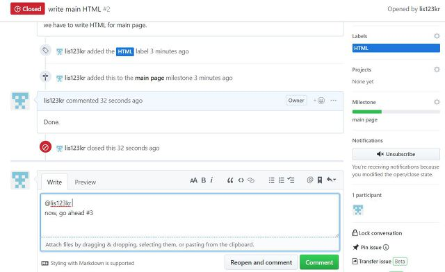
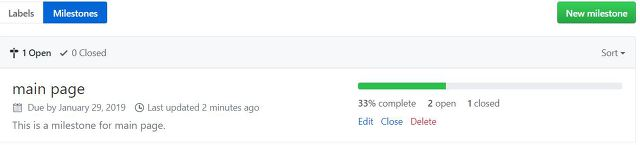

## Github Issue

프로젝트를 진행하면서 발생하는 모든 이슈 (버그 발생, 개발, 풀 리퀘스트 등등)  

1. **이슈 생성하기**

   

   → 참고로 이슈페이지에서 `@이름` 을 통해 다른 사용자를 언급할 수 있고, `#num` 을 통해 커밋, 이슈 들을 참조해 소통을 원활하게 할 수 있다.  

2. **Label 설정하기**

   각 이슈에 tag / label을 부여하여 이슈의 검색효율을 높인다.  

     

3. **해당 이슈에 대해 Assignees(책임자)를 부여**

   

     

   Assignees와 Labels를 각 이슈들에 부여한 후 목록페이지로 돌아오면 다음과 같이 깔끔하게 정리되어 있다. 이 label과 assignee를 통해 Filters 란에서 필터링하여 이슈를 검색할 수 있다.  

   - **Issue 키워드**
     - close
     - closes
     - closed
     - fix
     - fixes
     - fised
     - resolve
     - resolves
     - resolved
       `$ git commit -m "css 문제 해결 close #20"`
       `$ git commit -m "router 개발 close #20, #21, #23"`
       ⇒ 커밋 제목이나 내용에 추가하면 됨.

## Github MileStone

**각 기능별 서로 유사한 이슈들이 존재하며, 이 관련된 이슈들을 찾거나 해당 기능들이 얼마나 구현되었는지 파악하기 위해선 일일히 추적해야하는 어려움을 해소시킨다. ⇒** 마일스톤은 말그대로 이정표 역할을 하며, 이슈들을 그룹화하고 진행상황을 표현.  

  

이전에 Label을 부여한 것과 같이 이슈 상세페이지에서 마일스톤을 부여할 수 있다.  

마일스톤으로 3개의 이슈를 모두 묶을 수 있고, 만약 아래와 같이 하나의 이슈가 완료(close)되면 마일스톤의 진행상황이 업데이트 된다.  

  

이슈가 종료되면 아래 이미지와 같이 main page라는 마일스톤의 진행상황이 업데이트 되는 것을 볼 수 있다. 이 마일스톤 기능을 통해 연관된 이슈의 추적과 진행상황을 한 눈에 파악할 수 있다.  

## Github Project

프로젝트의 **칸반보드** 기능을 이용하면, 이슈들을 좀 더 조직화할 수 있고, 우선순위에 따라 정렬하거나 보다 한 눈에 workflow를 볼 수 있다.  

  

프로젝트의 이름과 템플릿을 설정한다. 여기서는
**"automated Kanban"**
을 선택해, 기본 템플릿이 있고 이슈를 알아서 어느정도 관리해주는 템플릿을 선택한다.  

  

프로젝트가 생성되면 아래와 같이 3개의 열로 구성된 기본 템플릿이 메인 창에 나타나며, 오른쪽 사이트 바엔 이전에 생성했던 열려있는(open) 이슈 카드 목록이 보인다. 3개의 열은 " To do ", " In Progress ", " Done "으로 구성되어, 해야할 Task와 진행 중인 Task, 완료된 Task를 묶을 수 있다.(그냥 Trello 보드랑 똑같이 쓰면 된다.)  

  

**직접 issue 카드를 생성할 수 있으며, 설정의 "Convert to issue" 통해 실제 issue로도 변환할 수 있다.**  

  

이전에는 Trello 보드를 이용해 이슈들을 관리했었는데, Github 내에서도 이 project 기능을 통해 별도의 트렐로와 같은 툴을 쓰지 않아도 프로젝트의 이슈들을 정리하고 관리할 수 있다.

## Github Wiki

위키는 HTML보다 간단한 마크업 언어(markup language)를 이용하여 문서를 공동으로 작성하고 관리할 수 있도록 해주는 방식이다. 별도의 위키 문법을 사용하여 문서를 편집하며 출력할 때에는 HTML로 변환되어 보여 지기 때문에 작성하는 사람과 보는 사람 모두에게 좋은 문서 환경을 제공한다.

- 현재 어디서나 가능하다.
- 한 문서 여러 사람이 편집할 수 있다.
- 최근 편집된 문서를 알 수 있다.
- 문서 편집 기록을 남길 수 있다.
- 문서를 검색할 수 있다.
- footer, sidebar 등을 생성할 수 있다.

⇒ 마크다운 파일을 웹페이지로 확장한 개념으로 이해하면 될 것 같다.
