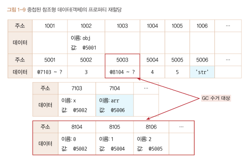
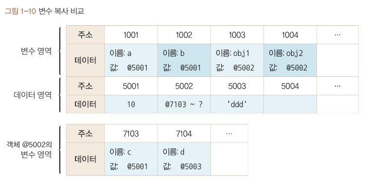
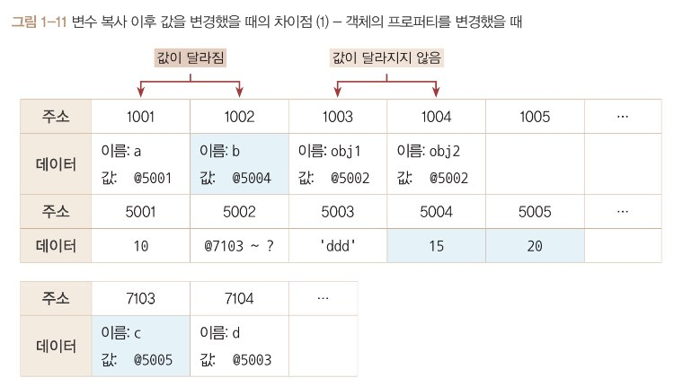
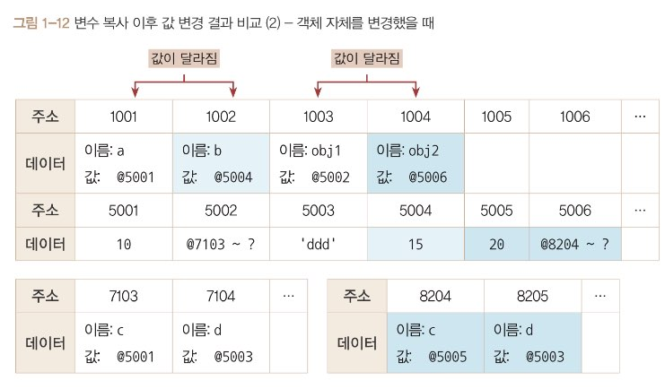
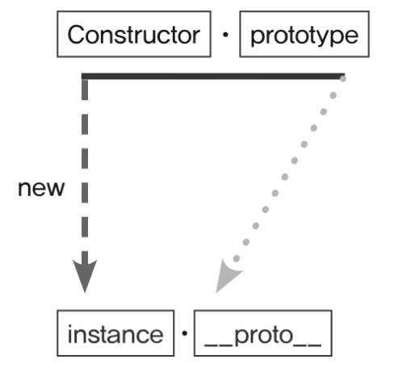
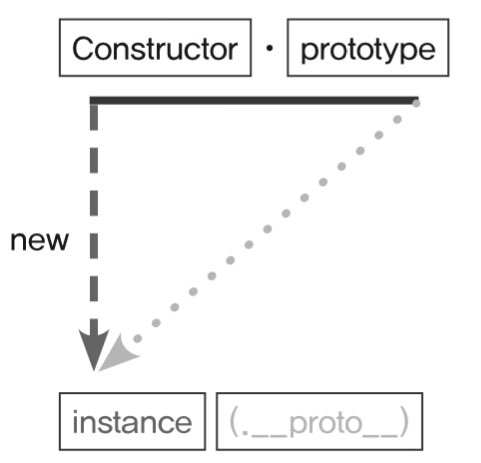
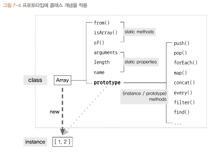
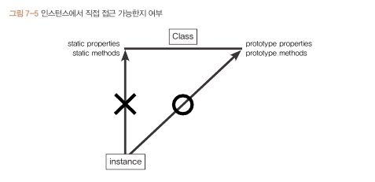

## 들어가기

다음 글은 코어자바스크립트 교재를 참고해서 자바스크립트에 대해 그동안 헷갈리던 부분과 핵심부분을 요약정리한 부분입니다.

## 1. 데이터 타입

**변수 :** 변경 가능한 데이터가 담길 수 있는 공간

**식별자 :** 그 변수의 이름을 말한다.

**참조 카운트 :** 자신의 주소를 참조하는 변수의 개수

**가비지 컬렉터(GC) :** 런타임 환경에 따라 특정 시점이나 메모리 사용량이 포화 상태에 임박할 때마다 자동으로 수거 대상들( 참조카운트 === 0 )을 수거합니다. 수거된 메모리는 다시 새로운 값을 할당할 수 있는 빈 공간이 됩니다.

**중첩된 참조형 데이터(객체)의 프로퍼티 재할당**

```jsx
var obj = {
  x: 3,
  arr: [3, 4, 5],
};

obj.arr = 'str';
```



⇒ @5003의 참조카운트는 @7104에 @5003이 저장돼어 있는 시점까지는 1이었다가 @7104에 @5006이 저장되는 순간 0이 됩니다. 참조카운트가 0인 메모리 주소는 가비지 컬렉터의 수거 대상이 됩니다.

**변수 복사 비교**
대부분의 자바스크립트 책에서 **'기본형은 값을 복사하고 참조형은 주소값을 복사한다.'**고 설명하고 있지만 사실은 **어떤 데이터 타입이든 변수에 할당하기 위해서는 주솟값을 복사해야 하기 때문에,** 엄밀히 따지면 자바스크립트의 모든 데이터 타입은 참조형 데이터일 수밖에 없습니다. **다만 기본형은 주솟값을 복사하는 과정이 한 번만 이뤄지고, 참조형은 한 단계를 더 거치게 된다는 차이가 있습니다.**

```jsx
var a = 10;
var b = a;
var obj1 = { c: 10, d: 'ddd' };
var obj2 = obj1;
```



**변수 복사 이후 값 변경 결과 비교 - 객체 프로퍼티 변경**

```jsx
var a = 10;
var b = a;
var obj1 = { c: 10, d: 'ddd' };
var obj2 = obj1;

b = 15;
obj2.c = 20;
```



**변수 복사 이후 값 변경 결과 비교 - 객체 자체 변경**

```jsx
var a = 10;
var b = a;
var obj1 = { c: 10, d: 'ddd' };
var obj2 = obj1;

b = 15;
obj2 = { c: 20, d: 'ddd' };
```



- **for in :** 객체의 프로퍼티들을 탐색할 때 씀.

**얕은 복사 :** 바로 아래 단계의 값만 복사하는 방법

```jsx
var copyObject = function (target) {
  var result = {};
  for (var props in target) {
    result[prop] = target[prop];
  }
  return result;
};

var user = {
  name: 'Jaenam',
  urls: {
    portfolio: 'http://github.com/abc',
    blog: 'http://blog.com',
    facebook: 'http://facebook.com/abc',
  },
};

var user2 = copyObject(user);

user2.name = 'Jung';
user.name === user2.name; // false

user2.urls.portfolio = 'http://portfolio.com';
user.urls.portfolio === user2.urls.portfolio; // true

user2.urls.blog = '';
user.urls.blog === user2.urls.blog; // true
```

**깊은 복사 :** 내부의 모든 값들을 하나하나 찾아서 전부 복사하는 방법

```jsx
var copyObjectDeep = function (target) {
  var result = [];
  if (typeof target === 'object' && target !== null) {
    for (var prop in target) {
      result[prop] = copyObjectDeep(target[prop]); // 재귀활용
    }
  } else {
    result = target;
  }
  return result;
};
```

- 기본형 데이터일 경우에는 그대로 복사하면 되지만, 참조형 데이터는 다시 그 내부의 프로퍼티들을 복사해야 한다.

**undefined vs null**

undefined와 null 둘다 없음을 나타내는데, undefined는 어떤 변수에 값이 존재하지 않을 경우를 의미하고, null은 사용자가 명시적으로 '없음'을 표현하기 위해 대입한 값.

**undefined**

1. 값을 대입하지 않은변수, 즉, 데이터 영역의 메모리 주소를 지정하지 않은 식별자에 접근할 때
2. 객체 내부의 존재하지 않는 프로퍼티에 접근하려고 할때
3. return 문이 없거나 호출되지 않은 함수의 실행 결과.
4. type of undefined는 undefined

**null**

1. 비어있음을 명시적으로 나타내고 싶을 때 사용.
2. type of null은 object입니다.

## 실행 컨택스트

실행할 코드에 제공할 환경 정보들을 모아놓은 객체로, 자바스크립트의 동적 언어로서의 성격을 가장 잘 파악할 수 있는 개념.

자바스크립트는 어떤 실행 컨텍스트가 활성화되는 시점에 선언된 변수를 위로 끌어올리고(호이스팅), 외부 환경 정보를 구성하고, this값을 설정하는 등의 동작을 수행한다.
콜스택에 실행컨텍스트가 순서대로 쌓이고 실행하는 식으로 전체 코드의 환경과 순서를 보장한다.

**호이스팅** : 선언 -> 할당 -> 실행
'끌어올린다'라는 의미로 변수 선언과 값 할당이 동시에 이뤄진 문장은 '선언부'만을 호이스팅하고 할당과정은 원래 자리에 남아있게 되는데, 여기서 함수 선언문과 표현식의 차이가 발생합니다.

**예시1**

```jsx
function a (0 {
	var x = 1;
	console.log(x);
	var x;
	console.log(x);
	var x = 2;
	console.log(x);
};
```

```jsx
function a (0 {
	var x; // 선언
	var x; // 선언
	var x; // 선언

	x = 1; // 할당
	console.log(x);
	console.log(x);
	x = 2; // 할당
	console.log(x);
};
```

**예시2**

```jsx
function a() {
  console.log(b);
  var b = 'bbb';
  console.log(b);
  function b() {}
  console.log(b);
}
```

```jsx
function a() {
  var b;
  function b() {}
  console.log(b);
  b = 'bbb';
  console.log(b);
  console.log(b);
}
```

**함수를 정의하는 세 가지 방식**

```jsx
// 함수 선언문. 함수명 a가 곧 변수명
function a() {}

// (익명) 함수 표현식. 변수 b가 곧 함수명
var b = function () {};

// 기명 함수 표현식. 변수명은 c, 함수명은 d
var c = function d() {};
c(); // OK
d(); // Error
```

→ 기명 함수 표현식은 외부에서는 함수명으로 함수를 호출할 수 없다.

**함수 선언문과 함수 표현식**

```jsx
console.log(sum(1, 2));
console.log(multiply(3, 4));

// 함수 선언문
function sum(a, b) {
  return a + b;
}

// 함수 표현식
var multiply = function (a, b) {
  return a * b;
};
```

```jsx
// 함수 선언문은 전체를 호이스팅 합니다.
var sum = function sum(a, b) {
  return a + b;
};

// 변수는 선언부만 끌어올립니다.
var multiply;

console.log(sum(1, 2));
console.log(multiply(3, 4));

// 변수의 할당부는 원래 자리에 남겨둡니다.
multiply = function (a, b) {
  return a * b;
};
```

**호이스팅 주의점 :** 전역 컨텍스트가 활성화 될때 전역공간에 선언된 함수들이 '모두' 가장 위로 끌어올려집니다. 동일한 변수명에 서로 다른 값을 할당할 경우 나중에 할당한 값이 먼저 할당한 값을 덮어씌운다. 따라서 코드를 실행하는 중에 실제로 호출되는 함수는 오직 마지막에 할당한 함수이다.

```jsx
function a() {
  console.log(sum(3, 4));
  function sum(x, y) {
    return x + y;
  }
  var a = sum(1, 2);
  function sum(x, y) {
    return x + ' + ' + y + ' = ' + (x + y);
  }
  var c = sum(1, 2);
  console.log(c);
}
```

```jsx
function a() {
  var sum = function sum(x, y) {
    return x + y;
  };
  var a;
  // 덮어쓰여짐...
  var sum = function sum(x, y) {
    return x + ' + ' + y + ' = ' + (x + y);
  };
  var c;
  console.log(sum(3, 4));
  a = sum(1, 2);
  c = sum(1, 2);
  console.log(c);
}
```

**예시3**

```jsx
var a = 1;
var outer = function () {
  var inner = function () {
    console.log(a);
    var a = 3;
  };
  inner();
  console.log(a);
};
```

```jsx
var a = 1;
var outer = function () {
  var inner = function () {
    var a;
    console.log(a); // undefined
    a = 3;
  };
  inner();
  console.log(a); // 1
};
```

## this

자바스크립트에서 this는 기본적으로 실행 컨텍스트가 생성될때 함께 결정된다. 즉, 함수를 호출할 때 결정된다.

함수로서 호출했는지 메서드로서 호출했는지만 파악하면 this값을 정확히 맞출 수 있다.
this 바인딩에 관해서는 함수를 실행하는 당시의 주변환경은 중요하지 않고, 오직 해당 함수를 호출하는 구문 앞에 점 또는 대괄호 표기가 있는지 없는지가 관건이다.

**전역공간에서의 this**

- windows(브라우저)

- global(Node.js)

**함수 vs 메서드**
둘다 미리 정의한 동작을 수행하는 코드 뭉치이지만, 유일한 차이는 독립성이다. 함수는 그 자체로 독립적인 기능을 수행하는 반면, 메서드는 자신을 호출한 대상 객체에 관한 동작을 수행한다.

**메서드에서의 this**
this는 호출한 주체에 대한 정보가 담긴다. 어떤 함수를 메서드로서 호출하는 경우 호출 주체는 바로 함수명(프로퍼티명)앞의 객체이다.

```jsx
var func = function (x) {
  console.log(this, x);
};

func(1); // windows {...} 1

var obj = {
  method: func,
};

obj.method(2); // { method: f } 2
```

**함수 내부에서의 this**
어떤 함수를 함수로서 호출할 경우에는 this가 지정되지 않습니다. this에는 호출한 주체에 대한 정보가 담긴다고 했지만, 함수로서 호출하는 것은 호출 주체를 명시하지 않고 개발자가 코드에 직접 관여해서 실행한 것이기 때문에 호출 주체의 정보를 알 수 없으며 실행 컨텍스트를 활성할 당시에 this가 지정되지 않은 경우, this는 전역 객체를 바라본다.

**메서드의 내부함수에서의 this**
어떤 함수를 호출할때 그 함수이름(프로퍼티) 앞에 객체가 명시돼 있는 경우에는 메서드로 호출한 것이고, 그렇지 않은 모든 경우에는 함수로 호출한것이다.

**내부 함수에서의 this**

```jsx
var obj1 = {
	outer: function () {
		console.log(this);
		var innerFunc = fucntion () {
			console.log(this);
		}
		innterFunc();

		var obj2 = {
			innerMethod: innerFunc
		};
		obj2.innerMethod();
	}
};

obj1.outer(); // { outer: f } -> Window {...} -> { innerMethod: f }
```

**this를 바인딩하지 않는 함수 (화살표 함수)**
ES6에서는 함수 내부에서 this가 전역객체를 바라보는 문제를 보완하고자, this를 바인딩하지 않는 화살표 함수를 새로 도입했다. 화살표 함수는 실행 컨텍스트를 생성할 때 this 바인딩 과정 자체가 빠지게 되어, 상위 스코프의 this를 그대로 활용할 수 있다. **스코프체인상 가장 가까운 this에 접근**.

```jsx
var obj = {
  outer: function () {
    console.log(this);
    var innerFunc = () => {
      console.log(this);
    };
    innerFunc();
  },
};

obj.outer(); // { outer: f } -> { outer: f }
```

**콜백함수 호출 시 그 함수 내부에서의 this**
콜백함수도 함수이기 때문에 기본적으로 this는 전역객체를 참조하지만, 제어권을 받은 함수에서 콜백함수에는 별도로 this가 될 대상을 지정한 경우에는 그 대상을 참조하게 된다.

```jsx
setTimeout(function () {
  console.log(this);
}, 300); // Window {...}

[1, 2, 3, 4, 5].forEach(function (x) {
  console.log(this, x);
}); // Window {...}

document.body.querySelector('.a').addEventListener('click', function (e) {
  console.log(this, e);
}); // 클래스명이 'a'인 엘리먼트
```

→ setTimeout 함수와 forEach 메서드는 그 내부에서 콜백 함수를 호출할 때 대상이 될 this를 지정하지 않는다. 따라서 콜백 함수 내부에서의 this는 전역객체를 참조한다. 한편, addEventListener 메서드는 콜백 함수를 호출할때 자신의 this를 상속하도록 정의돼 있다. 그러니깐 메서드명의 점(.) 앞부분이 곧 this 이다.

**생성자 함수 내부에서의 this**
어떤 함수가 생성자 함수로서 호출된 경우 내부에서의 this는 곧 새로 만들 구체적인 인스턴스 자신이 된다.

```jsx
var Cat = function (name, age) {
  this.name = name;
  this.age = age;
};

var choco = new Cat('초코', 7);
var nabi = new Cat('나비', 5);
console.log(choco, nabi);

/*
Cat { name: '초코', age: 7 }
Cat { name: '나비', age: 5 }
*/
```

**명시적으로 this를 바인딩하는 방법**

**call 메서드 - 호출 주체인 함수를 즉시 실행하는 명령**
메서드의 첫번째 인자를 this로 바인딩하고 이후의 인자들을 호출할 함수의 매개변수로 한다. 함수를 그냥 실행하면 this는 전역객체를 참조하지만 call 메서드를 이용하면 임의의 객체를 this로 지정할 수 있다.

```jsx
var func = function (a, b, c) {
  console.log(this, a, b, c);
};

func(1, 2, 3); // Window {...} 1 2 3
func.call({ x: 1 }, 4, 5, 6); // { x: 1 } 4 5 6
```

```jsx
var obj = {
  a: 1,
  method: function (x, y) {
    console.log(this.a, x, y);
  },
};

obj.method(2, 3); // 1 2 3
obj.method.call({ a: 4 }, 5, 6); // 4 5 6
```

**apply 메서드**

call메서드와 기능적으로 완전히 동일. 첫 번째 인자를 this로 바인딩하고 ,두번째 인자를 배열로 받아 그 배열의 요소들을 호출할 함수의 매개변수로 지정

```jsx
var func = function (a, b, c) {
  console.log(this, a, b, c);
};

func(1, 2, 3); // Window {...} 1 2 3
func.apply({ x: 1 }, [4, 5, 6]); // { x: 1 } 4 5 6
```

**bind 메서드**

call과 비슷하지만, 즉시 호출하지는 않고 넘겨받은 this 및 인수들을 바탕으로 새로운 함수를 반환하기만 하는 메서드.

```jsx
var func = function (a, b, c) {
  console.log(this, a, b, c);
};

func(1, 2, 3); // Window {...} 1 2 3
func.bind({ x: 1 })(4, 5, 6); // { x: 1 } 4 5 6
```

## 콜백함수

다른 코드의 인자로 넘겨주는 함수

콜백 함수는 함수이다. 콜백함수로 어떤 객체의 메서드를 전달하더라도 그 메서드는 메서드가 아닌 함수로서 호출된다. 즉, 객체의 메서드를 콜백 함수로 전달하면 해당 객체를 this로 바라볼 수 없게 된다.

```jsx
var obj = {
  vals: [1, 2, 3],
  logValues: function (v, i) {
    console.log(this, v, i);
  },
};
obj.logValues(1, 2); // { vals: [1, 2, 3], logValues: f } 1 2
[4, 5, 6].forEach(obj.logValues); // Window {...} 4 0
// Window {...} 5 1
// Window {...} 6 2
```

→ obj를 this로 하는 메서드를 글대로 전달한 것이 아니라, obj.logValues가 가리키는 함수만 전달한 것. 따라서 이 함수는 메서드로서 호출할 때가 아닌 한 obj와의 직접적인 연관이 없어진다. forEach에 의해 콜백이 함수로서 호출되고, 별도로 this를 지정하는 인자를 지정하지 않았으므로 함수 내부에서의 this는 전역객체를 바라보게 됩니다.

**콜백 함수 내부의 this에 다른 값 바인딩하기**

```jsx
var obj1 = {
  name: 'obj1',
  func: function () {
    console.log(this.name);
  },
};
setTimeout(obj1.func.bind(obj1), 1000);

var obj2 = { name: 'obj2' };
setTimeout(obj1, func.bind(obj2), 1500);
```

- 비동기 제어를 위해 콜백 함수를 사용하다 보면 콜백 지옥에 빠지기 쉽다. 콜백 지옥을 탈출하기 위해서 ES6에서는 Promise와 Generator등이 도입되었고, ES7에서는 async/await이 도입되었다.

## 클로저

- 함수를 선언할 때 만들어지는 유효범위가 사라진 후에도 호출할 수 있는 함수
- 이미 생명주기상 끝난 외부 함수의 변수를 참조하는 함수
- 자신이 생성될 때의 스코프에서 알 수 있었던 변수들 중 언젠가 자신이 실행될 때 사용할 변수들만을 기억하여 유지시키는 함수
  → 어떤 함수에서 선언한 변수를 참조하는 내부 함수에서만 발생하는 현상?
  → 외부함수의 LexicalEnvironment가 가비지 컬렉팅되지 않는 현상.
  ⇒ 어떤 함수 A가 선언한 변수 a를 참조하는 내부 함수 B를 외부로 전달할 경우 A의 실행 컨텍스트가 종료된 이후에도 변수 a가 사라지지 않는 현상

**외부 함수의 변수를 참조하는 내부함수**

```jsx
var outer = function () {
  var a = 1;
  var inner = function () {
    console.log(++a); // outer의 a를 참조
  };
  inner();
};
outer(); // 2
```

**outer의 실행 컨텍스트가 종료된 후에도 inner 함수를 호출**

```jsx
var outer = function () {
  var a = 1;
  var inner = function () {
    return ++a;
  };
  return inner; // inner 함수의 실행결과가 아닌 inner 함수 자체를 반환.
};

// outer 함수의 실행 컨텍스트가 종료될 때 outer2는 outer의 실행결과인 inner 함수를 참조
var outer2 = outer();

console.log(outer2()); // 앞서 반환된 inner가 실행 -> 2
console.log(outer2()); // 앞서 반환된 inner가 실행 -> 3
```

**How?**

가비지 컬렉터의 동장방식 때문. 가비지 컬렉터는 어떤 값을 참조하는 변수가 하나라도 있다면 그 값은 수집 대상에 포함시키지 않는다. outer 함수는 실행 종료 시점에 inner 함수를 반환하고 외부 함수인 outer의 실행이 종료되더라도 내부함수인 inner 함수는 언젠가 outer2를 실행함으로써 호출될 가능성이 있다. 따라서 inner 함수는 가비지 컬렉터에 수집 대상에 포함되지 않는다.

r**eturn 없이도 클로저가 발생하는 다양한 경우**

```jsx
(function () {
  var a = 0;
  var intervalId = null;
  var inner = function () {
    if (++a >= 10) {
      clearInterval(intervalId);
    }
    console.log(a);
  };
  intervalId = setInterval(inner, 1000);
})();
```

```jsx
(function () {
  var count = 0;
  var button = document.createElement('button');
  button.innerText = 'Click';
  button.addEventListener('click', function () {
    console.log(++count, 'times clicked');
  });
  document.body.appendChild(button);
})();
```

⇒ 지역변수를 참조하는 내부함수를 외부에 전달하는 클로저

**메모리 누수 관리가 필요하다.**

```jsx
var outer = function () {
  var a = 1;
  var inner = function () {
    return ++a;
  };
  return inner;
};

console.log(outer());
console.log(outer());

outer = null; // outer 식별자의 inner 함수 참조를 끊음.
```

```jsx
(function () {
  var a = 0;
  var intervalId = null;
  var inner = function () {
    if (++a >= 10) {
      clearInterval(intervalId);
      inner = null; // inner 식별자의 함수 참조를 끊음
    }
    console.log(a);
  };
  intervalId = setInterval(inner, 1000);
})();
```

```jsx
(function () {
	var count = 0;
	var button = document.createElement('button');
	button.innerText = 'Click';

	var clickHandler = function () {
		console.log(++count, 'times clicked');
		if (count >= 10) {
			button.remouveEventListener('click', clickHandler);
			clickHandler = null; // clickHandler 식별자의 참조를 끊음
	};
	button.addEventListener('click', clickHandler);
	document.body.appendChild(button);
})();
```

**활용사례**

1. 콜백함수 내부에서 외부 데이터를 사용하고자 할때

   ```jsx
   var fruits = ['apple', 'banana', 'peach'];
   var $ul = document.createElement('ul');

   fruits.forEach(function (fruit) {
     var $li = document.createElement('li');
     $li.innerText = fruit;
     $li.addEventListener('click', function () {
       alert('your choice is ' + fruit); // fruit이라는 외부 변수를 참조
     });
     $ul.appendchild($li);
   });
   document.body.appendchild($ul);
   ```

   → forEach문의 fruit이라는 변수를 forEach문이 끝난 후에도 가비지 컬렉터의 대상에서 제외되어 addEventListener 함수가 계속 참조 가능.

   ```jsx
   var alertFruit = function (fruit) {
     alert('your choice is ' + fruit);
   };

   var fruits = ['apple', 'banana', 'peach'];
   var $ul = document.createElement('ul');

   fruits.forEach(function (fruit) {
     var $li = document.createElement('li');
     $li.innerText = fruit;
     $li.addEventListener('click', alertFruit); // [object MouseEvent]
     $ul.appendChild($li);
   });
   document.body.appendChild($ul);
   ```

   → addEventListener는 콜백 함수를 호출할 대 첫 번째 인자에 '이벤트 객체'를 주입하기 때문에 [object MouseEvent] 가 출력된다.

   **해결법1 - bind**

   ```jsx
   var alertFruit = function (fruit) {
     alert('your choice is ' + fruit);
   };

   var fruits = ['apple', 'banana', 'peach'];
   var $ul = document.createElement('ul');

   fruits.forEach(function (fruit) {
     var $li = document.createElement('li');
     $li.innerText = fruit;
     $li.addEventListener('click', alertFruit.bind(null, fruit));
     $ul.appendChild($li);
   });
   document.body.appendChild($ul);
   ```

   **해결법2 - 고차 함수**

   ```jsx
   var alertFruit = function (fruit) {
   	return function () {

   	alert('your choice is ' + fruit);
   };

   var fruits = ['apple', 'banana', 'peach'];
   var $ul = document.createElement('ul');

   fruits.forEach(function (fruit) {
   		var $li = document.createElement('li');
   		$li.innerText = fruit;
   		$li.addEventListener('click', alertFruit(fruit));
   		$ul.appendChild($li);
   });
   document.body.appendChild($ul);
   ```

2. **접근 권한 제어 (정보은닉)**

   ```jsx
   var car = {
     fuel: Math.ceil(Math.random() * 10 * 10),
     power: Math.ceil(Math.random() * 3 * 2),
     moved: 0,
     run: function () {
       var km = Math.ceil(Math.random() * 6);
       var wasteFuel = km / this.power;
       if (this.fuel < wasteFuel) {
         console.log('이동불가');
         return;
       }
       this.fuel -= wasteFuel;
       this.moved += km;
       console.log(km + 'km 이동 (총 ' + this.moved + 'km)');
     },
   };
   ```

   → 조작 가능

   ```jsx
   car.fuel = 10000;
   car.power = 100;
   car.moved = 1000;
   ```

   → 클로저로 해결

   ```jsx
   var createCar = function () {
     var fuel = Math.ceil(Math.random() * 10 * 10);
     var power = Math.ceil(Math.random() * 3 * 2);
     var moved = 0;

     var publicMembers = {
       get moved() {
         return moved;
       },
       run: function () {
         var km = Math.ceil(Math.random() * 6);
         var wasteFuel = km / power;
         if (this.fuel < wasteFuel) {
           console.log('이동불가');
           return;
         }
         fuel -= wasteFuel;
         moved += km;
         console.log(km + 'km 이동 (총 ' + moved + 'km)');
       },
     };

     Object.freeze(publicMembers); // 객체를 리턴하기 전 미리 변경 불가.
     return publicMembers;
   };

   var car = createCar();
   car.run(); // 5km 이동 (총 5km)
   console.log(car.moved); // 5
   console.log(car.fuel); // undefined
   console.log(car.power); // undefined
   ```

   → createCar 함수를 실행함으로써 객체를 생성하도록 하고 fuel, power 변수는 비공개 멤버로 지정해 외부에서의 접근을 제한하고 moved 변수는 getter만을 부여함으로써 읽기 전용 속성을 부여함. 외부에서는 오직 run 메서드를 실행하고 현재의 moved를 확인하는 두 가지 동작만 할 수 있음.

3. **커링함수**

   여러 개의 인자를 받는 함수를 하나의 인자만 받는 함수로 나눠서 순차적으로 호출될 수 있게 체인 형태로 구성한 것을 말한다. 마지막 인자가 전달되기 전까지는 원본 함수가 실행되지 않습니다.

   ```jsx
   var getInformation = (baseUrl) => (path) => (id) => fetch(baseUrl + path + '/' + id);

   var imageUrl = 'http://imageAddress.com/';

   // 이미지 타입별 요청 함수 준비
   var getImage = getInformation(imageUrl);
   var getEmoticon = getImage('emoticon');
   var getIcon = getImage('icon');

   // 실제요청
   var emoticon1 = getEmoticon(100); // http://imageAddress.com/emoticon/100
   var icon1 = getIcon(300); // http://imageAddress.com/icon/300
   ```

   Redux의 미들웨어

   ```jsx
   // Redux Middleware 'Logger'
   const logger = (store) => (next) => (action) => {
     console.log('dispatching', action);
     console.log('next state', store.getState());
     return next(action);
   };
   // Redux Middleware 'thunk'
   const thunk = (store) => (next) => (action) => {
     return typeof action === 'function' ? action(dispatch, store.getState) : next(action);
   };
   ```

   ⇒ 두 미들웨어는 공통적으로 store, next, action 순으로 인자를 받는다. 이 중 store는 프로젝트 내에서 한 번 생성된 이후로는 바뀌지 않는 속성이고, dispatch의 의미를 갖는 next 역시 마찬가지지만, action의 경우는 매번 달라진다. 따라서 store와 next 값이 결정되면 Redux 내부에서 logger 또는 thunk에 store, next를 미리 넘겨서 변환된 함수를 저장시켜놓고, 이후에는 action만 받아서 처리할 수 있게끔 함.

## 프로토타입

자바스크립트는 프로토타입기반 언어.
어떤 객체를 원형으로 삼고 이를 복제(참조)함으로써 상속과 비슷한 효과를 얻는다.



- 어떤 생성자 함수(Constructor)를 `new` 연산자와 함께 호출하면 새로운 인스턴스가 생성된다.
- 인스턴스는 `__proto__` 라는 프로퍼티가 자동으로 부여된다.
- `__proto__` 는 Constructor의 `prototype` 이라는 프로퍼티를 참조한다.
- `prototype` 객체 내부에는 인스턴스가 사용할 메서드를 저장하고 인스턴스에서는 숨겨진 프로퍼티인 `__proto__` 를 이용해 이 메서드들에 접근한다.



prototype 객체를 참조하는 **proto**를 생략하면 인스턴스는 prototype에 정의된 프로퍼티나 메서드를 마치 자신의 것처럼 사용할 수 있다.

```jsx
Person = function (name) {
  this._name = name;
};

Person.prototype.getName = function () {
  return this._name;
};

var suzi = new Person('Suzi');
suzi.__proto__.getName(); // undefined
```

→ `suzi.__proto__.getName()` 여기서의 this는 `suzi`가 아니라 `suzi.__proto__` 의 this이다. 따라서 찾고자 하는 `_name`이 없다.

```jsx
var suzi = new Person('Suzi');
suzi.__proto__._name = 'SUZI_proto__';
suzi.__proto__.getName(); // SUZI_proto__
```

```jsx
Person = function (name) {
  this._name = name;
};

Person.prototype.getName = function () {
  return this._name;
};

var suzi = new Person('Suzi');
suzi.getName(); // Suzi <-- __proto__ 생략
```

## 클래스

내부 프로퍼티들 중 prototype 프로퍼티를 제외한 나머지는 인스턴스에 상속되지 않는다.



```jsx
// 생성자
var Rectangle = function (width, height) {
  this.width = width;
  this.height = height;
};

// (프로토타입) 메서드
Rectangle.prototype.getArea = function () {
  return this.width * this.height;
};

// 스태틱 메서드 - 인스턴스에 상속되지 않음.
Rectangle.isRectangle = function (instance) {
  return instance instanceof Rectangle && instance.width > 0 && indstance.height > 0;
};

var rect1 = new Rectangle(3, 4);
console.log(rect1.getArea()); // 12
console.log(rect1.isRectangle(rect1)); // Error
console.log(Rectangle.isRectangle(rect1)); // true
```


