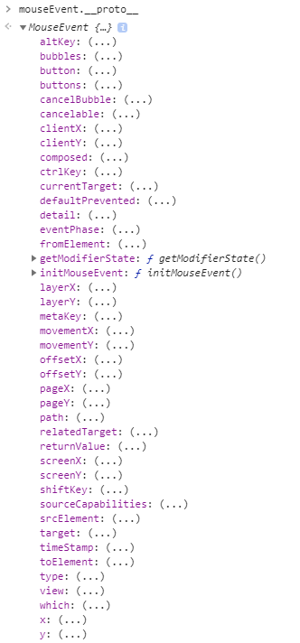

## MouseEvent

- 해당 마우스 이벤트의 위치를 알기 위해 사용되는 프로퍼티는 다음과 같다.
  - pageX, pageY
  - ClientX, ClientY
  - offsetX, offsetY
  - layerX, layerY
  - screenX, screenY
- 마우스이벤트의 `__proto__` 를 살펴보자
  
- **screenX, screenY:**
  모니터 화면 기준으로 현재 커서의 위치를 알려줍니다. 즉 브라우저 위치를 변경하면 같은 HTMLElement를 가르키고 있다고 해도, 다를 수 있습니다.
- **pageX, pageY:**
  브라우저의 내용이 보이는 부분(뷰 포트) 최상단 왼쪽을 (0,0)을 기준으로 하여서 현재 마우스의 위치를 알려줍니다.
- **clientX, clientY:**
  위의 pageX, pageY와 동일하나, 뷰 포트에 스크롤이 있을 경우에 달라집니다.
- **offsetX, offsetY:**
  현재 마우스가 올려져있는 Elements 중 가장 자식 Elements의 최상단 왼쪽을 기준으로 마우스 위치를 알려줍니다.

## HTMLElement의 위치 구하기

- HTMLElement의 위치를 구하는 방법은 3가지가 있다.
  - **getBoundingClientRect();**
  - **getClientRects();**
  - **offsetLeft, offsetTop, offsetRight, offsetBottom**

## offsetX 시리즈

- HTMLElement의 위치의 기준이 **position이 relative인** 부모 엘리먼트들 중에서 가장 가까운 부모 엘리먼트와의 거리를 알려준다. 기준이 position: absolute일 때 기준이 되는 부모 엘리먼트와 동일하다고 볼 수 있다.

## getBoundingClientRect vs getClientRects

**W3C docs**

The getClientRects() method, when invoked, must return the result of the following algorithm:

1. If the element on which it was invoked does not have an associated [layout box](https://www.w3.org/TR/cssom-view/#layout-box) return an empty sequence and stop this algorithm.
2. If the element has an associated [SVG layout box](https://www.w3.org/TR/cssom-view/#svg-layout-box) return a sequence containing a single `[DOMRect](https://www.w3.org/TR/geometry-1/#dom-domrect)` object that describes the bounding box of the element as defined by the SVG specification, applying the [transforms](https://www.w3.org/TR/cssom-view/#transforms) that apply to the element and its ancestors.
3. Return a sequence containing static `[DOMRect](https://www.w3.org/TR/geometry-1/#dom-domrect)` objects in content order, one for each [box fragment](https://www.w3.org/TR/css3-break/#box-fragment), describing its border area (including those with a height or width of zero) with the following constraints:
   - Apply the [transforms](https://www.w3.org/TR/cssom-view/#transforms) that apply to the element and its ancestors.
   - If the element on which the method was invoked has a computed value for the [display](https://www.w3.org/TR/CSS21/visuren.html#propdef-display) property of [table](https://www.w3.org/TR/css-display-3/#valdef-display-table) or [inline-table](https://www.w3.org/TR/css-display-3/#valdef-display-inline-table) include both the table box and the caption box, if any, but not the anonymous container box.
   - Replace each [anonymous block box](https://www.w3.org/TR/CSS21/visuren.html#anonymous-block-level) with its child box(es) and repeat this until no anonymous block boxes are left in the final list.

The getBoundingClientRect() method, when invoked, must return the result of the following algorithm:

1. Let list be the result of invoking `[getClientRects()](https://www.w3.org/TR/cssom-view/#dom-element-getclientrects)` on the same element this method was invoked on.
2. If the list is empty return a static `[DOMRect](https://www.w3.org/TR/geometry-1/#dom-domrect)` object whose `[x](https://drafts.fxtf.org/geometry-1/#dom-domrect-x)`, `[y](https://drafts.fxtf.org/geometry-1/#dom-domrect-y)`, `[width](https://drafts.fxtf.org/geometry-1/#dom-domrect-width)` and `[height](https://drafts.fxtf.org/geometry-1/#dom-domrect-height)` members are zero.
3. Otherwise, return a static `[DOMRect](https://www.w3.org/TR/geometry-1/#dom-domrect)` object describing the smallest rectangle that includes the first rectangle in list and all of the remaining rectangles of which the height or width is not zero.
