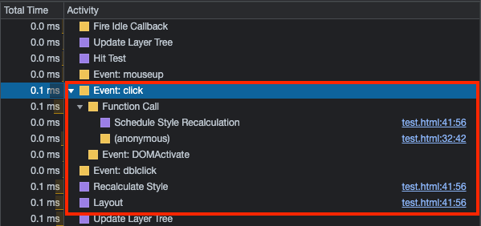
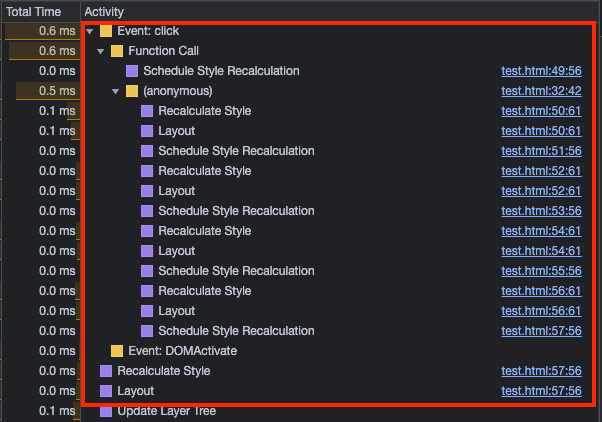

## Reflow는 언제 발생하는가?

성능 최적화를 위해 Reflow를 줄이는 방법에 대해서 알아보는 중 DOM의 위치나 사이즈를 가져오는 것도 reflow를 발생시킬 수 있다는 내용을 접하게 되었고 테스트를 진행해보았습니다.

먼저 그냥 단순히 사이즈나 위치를 가져오는 것은 reflow를 발생시키지 않지만, DOM의 스타일을 수정하는 경우 정확한 사이즈나 위치 정보를 가져오기 위해서 강제 reflow가 발생할 수 있습니다.

요약하면,

- 모양, 크기, 위치 등을 바꾸면 레이아웃(렌더링 과정 중 일부)을 다시 계산해야합니다.
- `함수실행 -> 렌더링 -> 함수실행 -> 렌더링`이 반복되는 과정 중에 모양, 크기, 위치 데이터에 접근하게 되면, 브라우저가 함수 실행 중간에 바뀐 값을 얻어야하기 때문에 reflow가 발생합니다.
- 따라서 함수 실행 중간 중간에 reflow가 불필요하게 많이 발생하게 됨.

여러 포스팅을 찾아보던 중, style변경과 style접근을 덩어리 단위로 해주면 불필요한 reflow들이 해소된다는 내용을 바탕 하단의 코드를 작성해서 테스트를 진행해보았습니다.

```jsx
let flag = true;
document.addEventListener('click', () => {
  flag = !flag;
  if (flag) {
    // GOOD
    const box1Height = document.querySelector('.box1').clientHeight;
    const box2Height = document.querySelector('.box2').clientHeight;
    const box3Height = document.querySelector('.box3').clientHeight;
    const box4Height = document.querySelector('.box4').clientHeight;
    const box5Height = document.querySelector('.box5').clientHeight;

    document.querySelector('.box1').style.height = box1Height + 500 + 'px';
    document.querySelector('.box2').style.height = box2Height + 500 + 'px';
    document.querySelector('.box3').style.height = box3Height + 500 + 'px';
    document.querySelector('.box4').style.height = box4Height + 500 + 'px';
    document.querySelector('.box5').style.height = box5Height + 500 + 'px';
  } else {
    // BAD
    const box1Height = document.querySelector('.box1').clientHeight;
    document.querySelector('.box1').style.height = box1Height - 500 + 'px';
    const box2Height = document.querySelector('.box2').clientHeight;
    document.querySelector('.box2').style.height = box2Height - 500 + 'px';
    const box3Height = document.querySelector('.box3').clientHeight;
    document.querySelector('.box3').style.height = box3Height - 500 + 'px';
    const box4Height = document.querySelector('.box4').clientHeight;
    document.querySelector('.box4').style.height = box4Height - 500 + 'px';
    const box5Height = document.querySelector('.box5').clientHeight;
    document.querySelector('.box5').style.height = box5Height - 500 + 'px';
  }
});
```

상단 코드를 GOOD 코드, 하단 코드를 BAD 코드로 이야기하겠습니다.

먼저, GOOD 코드의 퍼포먼스 결과는



이와 같이 Layout 과정이 한번 찍혀있고, reflow가 한번 발생했습니다.

다음으로, BAD 코드의 퍼포먼스 결과는



이와 같이 Layout 과정이 5번 찍혀있고, reflow가 5번 발생했음을 알 수 있었습니다.

위의 결과를 바탕으로 reflow의 발생 위치를 보았을 때, 다음과 같았습니다.

```jsx
let flag = true;
document.addEventListener('click', () => {
  flag = !flag;
  if (flag) {
    // GOOD
    const box1Height = document.querySelector('.box1').clientHeight;
    const box2Height = document.querySelector('.box2').clientHeight;
    const box3Height = document.querySelector('.box3').clientHeight;
    const box4Height = document.querySelector('.box4').clientHeight;
    const box5Height = document.querySelector('.box5').clientHeight;

    // 🚨 **Reflow**
    document.querySelector('.box1').style.height = box1Height + 500 + 'px';
    document.querySelector('.box2').style.height = box2Height + 500 + 'px';
    document.querySelector('.box3').style.height = box3Height + 500 + 'px';
    document.querySelector('.box4').style.height = box4Height + 500 + 'px';
    document.querySelector('.box5').style.height = box5Height + 500 + 'px';
  } else {
    // BAD
    const box1Height = document.querySelector('.box1').clientHeight;
    document.querySelector('.box1').style.height = box1Height - 500 + 'px';
    // 🚨 **Reflow**
    const box2Height = document.querySelector('.box2').clientHeight;
    document.querySelector('.box2').style.height = box2Height - 500 + 'px';
    // 🚨 **Reflow**
    const box3Height = document.querySelector('.box3').clientHeight;
    document.querySelector('.box3').style.height = box3Height - 500 + 'px';
    const box4Height = document.querySelector('.box4').clientHeight;
    // 🚨 **Reflow**
    document.querySelector('.box4').style.height = box4Height - 500 + 'px';
    // 🚨 **Reflow**
    const box5Height = document.querySelector('.box5').clientHeight;
    // 🚨 **Reflow**
    document.querySelector('.box5').style.height = box5Height - 500 + 'px';
  }
});
```

보통 모니터가 60Hz 라서 16.6ms 마다 화면을 그리는데, 예를 들어 element를 x를 0에서 100으로 100에서 200으로 ... 와 같이 style 변경이 일어날 경우, 한번에 묶어두었다가 주사율이 변경될 때, 즉, 프레임1 → 프레임2로 넘어갈 때, 한번에 처리를 합니다. 하지만, 만약에 예를 들어 x를 0에서 200으로 옮긴 후에 style 정보를 가져오는 상황과 같이 style 변경 후에 style 정보를 가져오게 되면, 변경된 style 정보는 실제 스타일 변경이 이루어진 후에나 가져올 수 있으므로 강제 reflow를 시키게 됩니다.

내용을 코드와 함께 보면,

```jsx
let flag = true;
document.addEventListener('click', () => {
  flag = !flag;
  if (flag) {
    // GOOD
    const box1Height = document.querySelector('.box1').clientHeight;
    const box2Height = document.querySelector('.box2').clientHeight;
    const box3Height = document.querySelector('.box3').clientHeight;
    const box4Height = document.querySelector('.box4').clientHeight;
    const box5Height = document.querySelector('.box5').clientHeight;

    // 🚨 style 변경을 한번에 묶어서 주사율 변경될 때 처리. Reflow는 한번만 일어난다.
    document.querySelector('.box1').style.height = box1Height + 500 + 'px';
    document.querySelector('.box2').style.height = box2Height + 500 + 'px';
    document.querySelector('.box3').style.height = box3Height + 500 + 'px';
    document.querySelector('.box4').style.height = box4Height + 500 + 'px';
    document.querySelector('.box5').style.height = box5Height + 500 + 'px';
  } else {
    // BAD
    const box1Height = document.querySelector('.box1').clientHeight;
    document.querySelector('.box1').style.height = box1Height - 500 + 'px';
    // 🚨 위에서 style이 변경되었고 아래에서 style 정보를 가져오므로 강제 Reflow
    const box2Height = document.querySelector('.box2').clientHeight;
    document.querySelector('.box2').style.height = box2Height - 500 + 'px';
    // 🚨 위에서 style이 변경되었고 아래에서 style 정보를 가져오므로 강제 Reflow
    const box3Height = document.querySelector('.box3').clientHeight;
    document.querySelector('.box3').style.height = box3Height - 500 + 'px';
    const box4Height = document.querySelector('.box4').clientHeight;
    // 🚨 위에서 style이 변경되었고 아래에서 style 정보를 가져오므로 강제 Reflow
    document.querySelector('.box4').style.height = box4Height - 500 + 'px';
    // 🚨 위에서 style이 변경되었고 아래에서 style 정보를 가져오므로 강제 Reflow
    const box5Height = document.querySelector('.box5').clientHeight;
    // 🚨 style 변경하니깐 Reflow
    document.querySelector('.box5').style.height = box5Height - 500 + 'px';
  }
});
```
