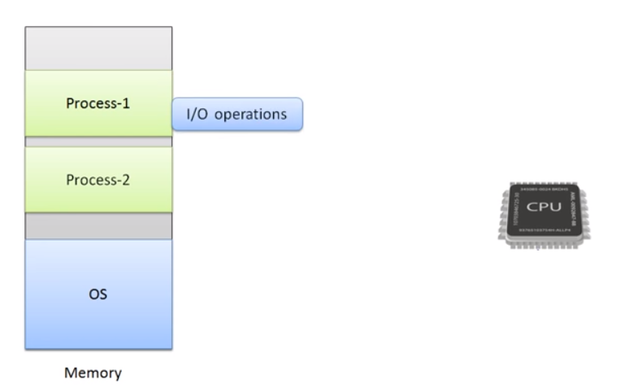
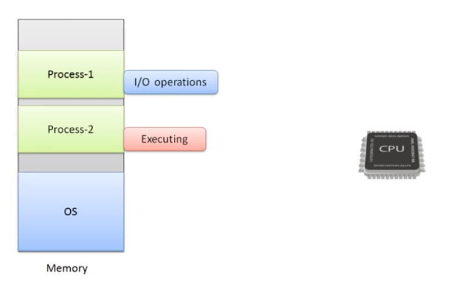
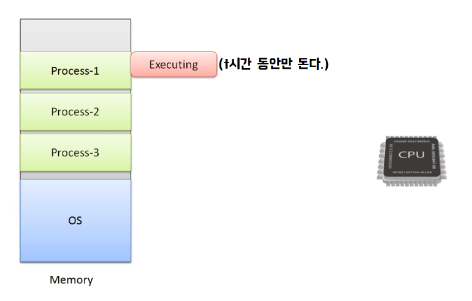
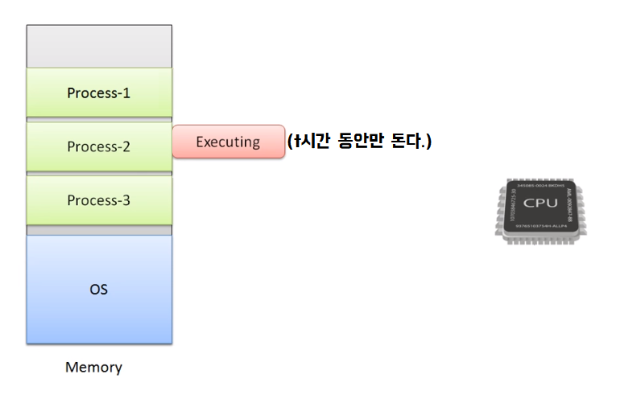
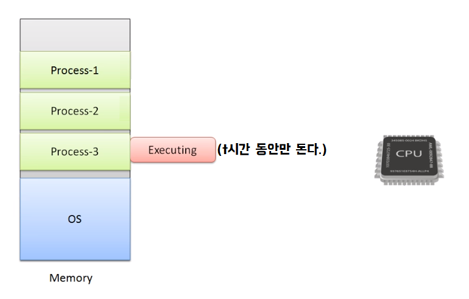
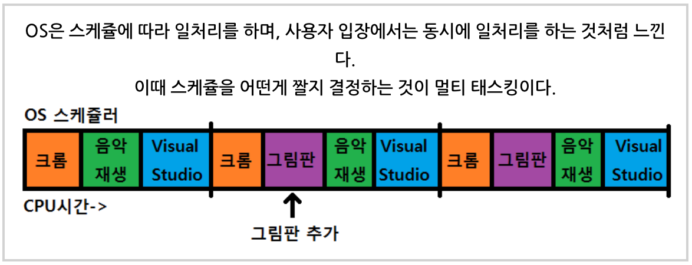
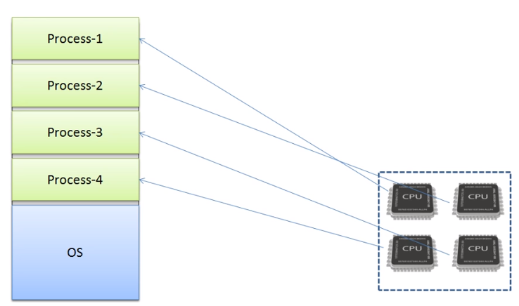
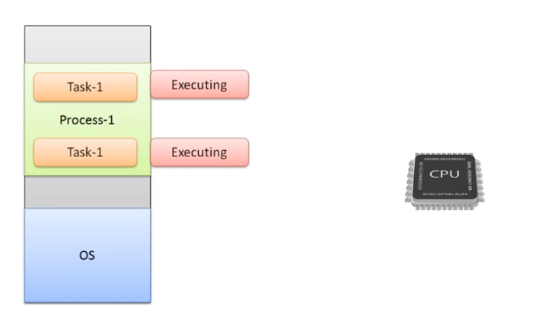

## 들어가기

**프로그램**

어떤 작업을 위해 실행할 수 있는 파일

ex) 메모장

**프로세스**

실행중인 프로그램

**스레드**

실행중인 프로그램 안에서의 실행되는 명령어

ex) 특정 노래를 재생하는 스레드 및 새로운 노래를 재생 목록에 추가하기 위한 스레드

**멀티프로그래밍**

하나의 CPU 상에서 여러 프로세스가 동시에 실행 되는 것을 의미한다. 즉, 하나의 CPU가 I/O를 하게 되면 입출력에 대한 응답을 무한정 기다리게 되는데 이렇게 대기하는 동안 프로세서가 다른 프로세스를 진행 할 수 있도록 하는 것이다.

**멀티태스킹**

멀티태스킹은 스케줄러 알고리즘에 따라 조금씩 번갈아 가면서 프로세스가 수행되는 것이다. 이때 멀티프로그래밍과 다른점은 멀티 프로그래밍은 하나의 프로세스가 I/O가 당하기 전까지는 끝까지 실행 되지만 멀티 태스킹은 실행되는 도중에 특정 시간 이상 CPU를 점유하게 되면 그다음 프로세스에게 프로세서 자원을 넘겨주는 방식이다

**멀티프로세싱**

멀티 프로세싱은 여러 프로세서 상에서 여러 프로세스가 동시에 실행 되는 것을 의미한다.

**멀티스레딩**

멀티스레딩은 하나의 프로세스에서 여러 스레드가 동시에 실행 되는 것을 의미한다.

실제 한번에 두가지 일을 `동시에 병렬`로 처리하는 것이 아니라 번갈아 가며 처리하여 동시에 작업이 처리되는 것처럼 느끼게 하는 방식.

ex) 채팅의 경우 - 멀티스레드를 사용하여 상대방의 메시지 다운과 입력을 동시에 처리.

**싱글스레드**

싱글스레드는  하나의 직렬로 처리하는 스레드 방식을 의미한다. 즉, 하나의 요청이 있으면 하나를 처리할 때까지 다음 요청은 대기상태. (하나씩만 실행 할 수 있음)

ex) 채팅의 경우 - 상대방의 메시지를 다운 받는 동안 입력 불가.

