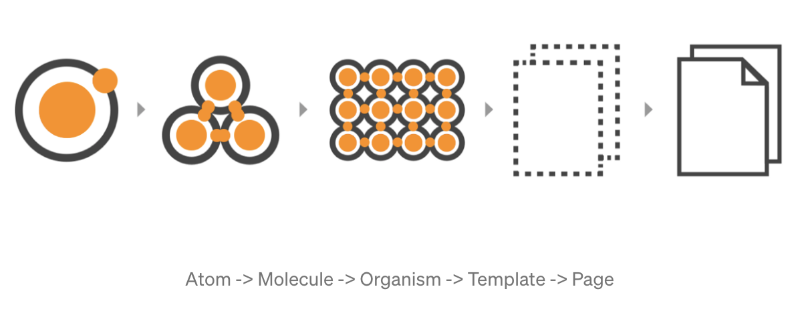
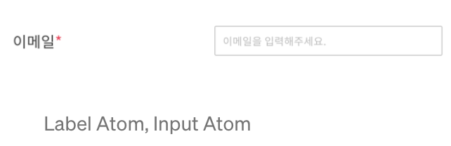
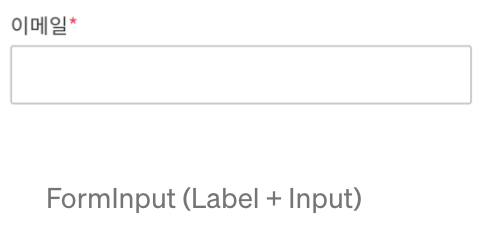
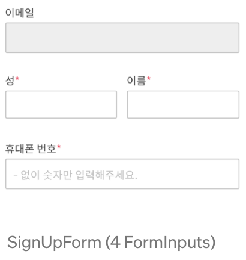
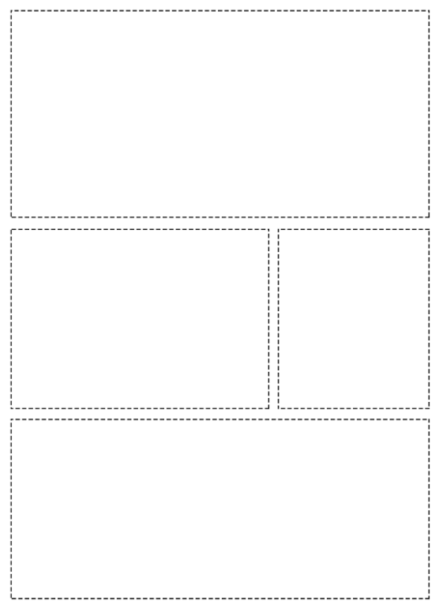
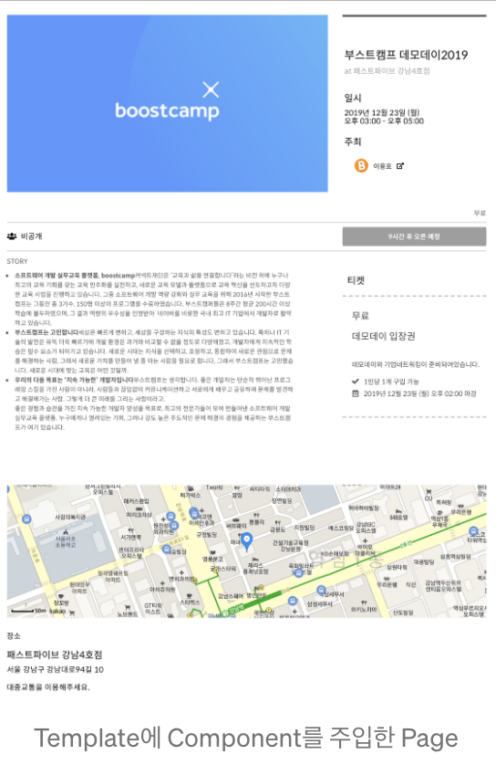
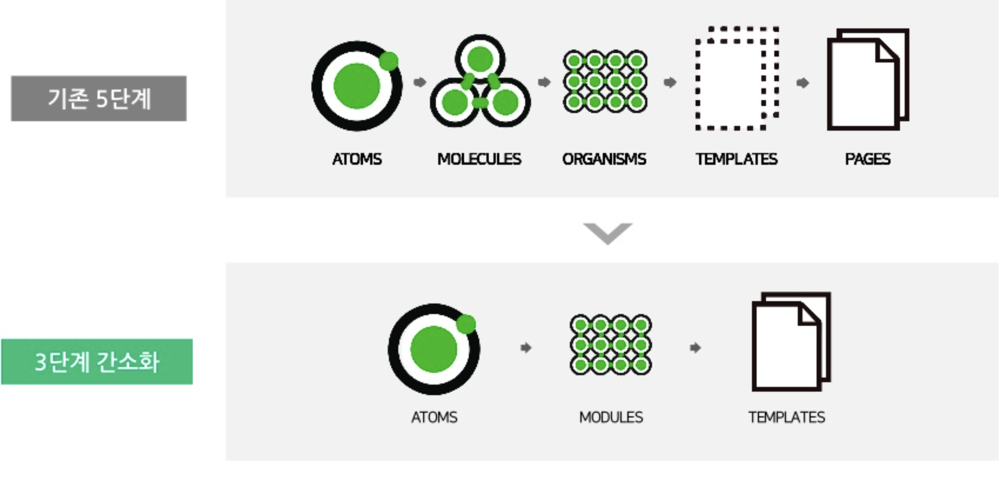
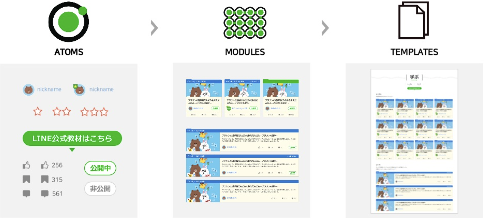

## 아토믹 디자인

디자인 요소들을 나누어 파악하고 이 요소들을 조합을 통해서 디자인을 구성하는 방식. 즉, 컴포넌트 중심의 디자인 패턴.

리액트는 컴포넌트를 중심으로 만들어지는 프레임워크로, 컴포넌트의 재사용성이 매우 중요하다. 중복이 되는 컴포넌트를 공통으로 사용할 수 있도록 빼는 것이 관건인데, 이것은 개발을 진행하다 보면 일일히 생각하며 진행하는 것이 어렵다. 결국에는 중복되는 코드가 많아지고, 이를 관리하는 것이 어려워지게 되는 것이다. 그렇기에 개발 단계 처음부터 재사용성이 용이하며, 여러 개의 컴포넌트들을 모아 또 다른 컴포넌트를 만들 수 있도록(조립) 고민하며 개발하는 것이 아토믹 디자인이다.

## 컴포넌트

하나의 컴포넌트는 한 가지 일을 하는게 이상적(단일 책임 원칙)

## 컴포넌트 분리 기준




## 아톰 (Atoms)

Label, Input, CheckBox, Select같은 HTML 태그 같이 기능적/의미론적으로 가장 작은 단위의 컴포넌트.

특정 기능을 수행하는 것이 아니라 일반적으로 사용할 수 있도록 구현.

ex) Input 태그의 onChange와 값이 어딘가에 종속되지 않도록 props로 전달받아 사용.



## 모큘 (Molecules)

Atoms를 조합한 컴포넌트. Label + (Input | CheckBox | Select) 조합으로 FormItem 이라는 컴포넌트를 만들 수 있다.



## 올가니즘 (Organisms)

Molecule과 Atoms를 조합. FormItem 여러 개와 버튼을 조합하여 SignUpForm을 만들 수 있다.

Organism 역시 특정 기능을 직접적으로 수행하진 않지만, 특정한 컴포넌트들을 조합하다 보니 재사용성이 조금 떨어짐



## 템플릿 (Templates)

레이아웃, 컴포넌트를 주입받기 위해 준비하는 Template. 비즈니스 로직이 아니라 완전히 스타일링에 집중한 단위.

컴포넌트를 주입만 하면 바로 사용할 수 있음.



## 페이지 (Pages)

템플릿에 알맞은 컴포넌트를 주입하게 되면, template에서 미리 만들어 놓은 레이아웃에 맞게끔 사용할 수 있도록 한다. 전체적인 로직이나 상태 등을 Page 레벨에서 컨트롤해야 한다.



## 디렉토리 구조

```
src
├── components
│	  ├── atoms
│   │   ├── atom1
│		│   │   ├── index.tsx
│		│   │   ├── index.stories.tsx
│		│   │   └── style.ts
│	  │   └── ...
│	  ├── mocules
│   │   ├── mocule1
│		│   │   ├── index.tsx
│		│   │   ├── index.stories.tsx
│		│   │   └── style.ts
│	  │   └── ...
│	  └── organisms
│       ├── organism1
│		    │   ├── index.tsx
│	      │   ├── index.stories.tsx
│		    │   └── style.ts
│	      └── ...
└── pages
 	  ├── BasedTemplate
 		│   ├── index.tsx
 		│   ├── index.stories.tsx
 		│   └── style.ts
 	  ├──page1
 		│   ├── template
		│		│ 	├── index.tsx
		│		│		└── style.ts
 		│   ├── index.tsx
 		│   ├── index.stories.tsx
 		│   └── style.ts
		└── ...
```

## 상태관리

각각 컴포넌트의 일반적인 상태 (disabled, focused 등)은 각 컴포넌트에서의 상태를 관리하되 직접적인 사용이 필요한 데이터에 대한 상태는 Page 레벨에서 주입하여 props로 내리는 방식으로 관리.

전역으로 관리할 state를 제외하곤 각 page 별로 state를 관리했고, 해당 상태를 page -> organism -> molecule -> atom으로 props를 내려주는 방식이지만, 실질적으로 low level(atom)에서부터 general 하게 구현을 했기 때문에 크게 신경을 쓸 부분은 page뿐일 것이다. 다만, 주의를 해야 할 부분은 props로 전달하다 보니 의도치 않은 props를 내려줄 실수가 발생할 수 있는데 typescript를 도입함으로써 props의 타입을 강제함으로써 그러한 이슈를 막을 수 있을 것이다.

## 간소화된 아토믹 디자인 설계

기존의 아토믹 디자인은 컴포넌트 분리를 세분화 시키다보니 초기 설계를 잘못하다보면 분리 기준이 모호한 컴포넌트가 발생하며 재사용성이라는 처음의 도입 목적과 다르게 원래의 코드로 돌아갈 가능성이 있다. 따라서 이러한 세분화 보다는 조금 간소화 시켜 아토믹 디자인을 도입하는 방법을 고민해보았다.

### Line의 아토믹 적용 방법





### 디렉토리 구조

```
src
└── components
 	  ├── atoms
    │   ├── atom1
 		│   │   ├── index.ts
 		│   │   └── index.stories.ts
 	  │   └── ...
 	  ├── modules
    │   ├── module1
 		│   │   ├── index.ts
 		│   │   └── index.stories.ts
 	  └── templates
        ├── template1
 		    │   ├── index.ts
 		    │   └── index.stories.ts
 	      └── ...
```

### 아토믹 디자인의 효율을 높이기 위한 방법

1. 재사용성을 높이기 위한 Styled-Component 사용
   - 컴포넌트 생성과 동시에 스타일링을 하기 때문에 스타일을 여러 곳에서 불러올 필요가 없다.
   - porps 값을 스타일링 할 때 그대로 사용가능하다.
   - 컴포넌트별 반응형 스타일 지정이 가능하다.
2. 컴포넌트 단위의 개발 효율을 높여주는 Storybook 사용
   - 외부 환경에 의존하지 않고 독립된 환경에서 뷰에만 집중하여 UI를 컴포넌트 별로 분리한 개발환경을 제공하는 툴
   - 다양한 유스케이스를 한눈에 확인할 수 있다.
   - Addon을 통해 개발에 필요한 옵션을 직접 추가할 수 있다.
   - 간단하게 정적인 페이지를 내보낼 수 있다.

## 아토믹 디자인 규칙

1. 원자에 margin이나 position과 같은 위치에 영향을 주는 속성을 지정하지 않는다. (페이지내에서 사이드 이펙트를 일으킬 수 있음)
2. 컴포넌트들은 상태를 가지지 않아야 한다.
3. 오직 분자나, 유기체만이 원자들의 위치를 지정할 수 있으며 마찬가지로 자기 자신의 position과 margin을 지정해선 안된다.
4. 템플릿은 오직 그리드만을 가져야하고, 특정 컴포넌트의 위치를 지정해선 안된다.
5. 템플릿위에 컴포넌트를 렌더링하여 페이지를 완성시킨다.
6. 변수를 모아두는 파일(테마나 색상 변수값들)을 만들고 모든 아토믹 컴포넌트가 이 변수를 사용하게끔 만든다.

## 참고자료

[Atomic Design for React](https://medium.com/@inthewalter/atomic-design-for-react-514660f93ba)

[Line Entry의 Atomic Design 적용기](https://www.slideshare.net/NaverEngineering/line-entry-atomic-design)

[리액트 어플리케이션 구조 - 아토믹 디자인](https://ui.toast.com/weekly-pick/ko_20200213/)

[storybook and atomic design](https://simsimjae.tistory.com/392)

[diegohaz/arc](https://github.com/diegohaz/arc)

[Atomic Design](https://bradfrost.com/blog/post/atomic-web-design/)

[Atomic Design -Methodology](https://medium.muz.li/atomic-design-methodology-166261ce47c2)

[React로 사고하기 - React](https://ko.reactjs.org/docs/thinking-in-react.html)

[Atomic Design with React](https://codeburst.io/atomic-design-with-react-e7aea8152957)
