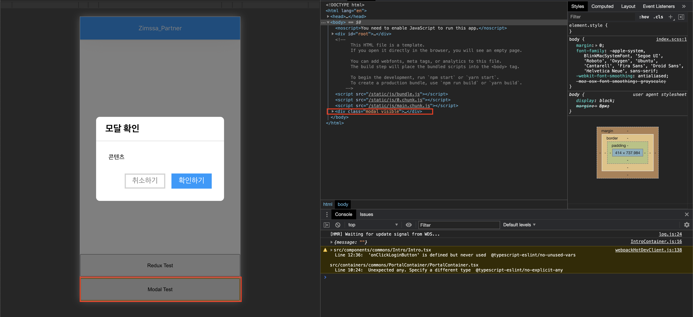

## **리액트 포탈**

논리적으로 하위 컴포넌트여야 하는데, 시각적으로는 상위 컴포넌트를 덮어야 할 상황일 때 사용

리액트 v16 에서 도입된 기능으로, 기존의 리액트에서 컴포넌트를 렌더링 하게 될 때, children 은 부모컴포넌트의 DOM 내부에 렌더링 되어야 하지만, Portals 를 사용하면 DOM 의 계층구조 시스템에 종속되지 않으면서 컴포넌트를 렌더링 할 수 있습니다. 따라서 모달창과 같은 다이얼로그 컴포넌트를 리액트 포탈을 이용해 개선

**PortalContainer 구현**

```tsx
// Portal Component
import React, { useState, useRef, useEffect } from 'react';
import { createPortal } from 'react-dom';

interface IPortalProps {
  children: React.ReactNode;
  selector: string;
}

export const PortalContainer: React.FC<IPortalProps> = ({ children, selector }) => {
  const ref = useRef<any>();
  const [mounted, setMounted] = useState(false);

  useEffect(() => {
    ref.current = document.querySelector(selector);
    setMounted(true);
  }, [selector]);

  return mounted ? createPortal(children, ref.current) : null;
};
```

**모달 컴포넌트 구현 (모달 레이아웃)**

```tsx
// Modal Component
import React, { Dispatch, SetStateAction } from 'react';
import styles from './Modal.module.scss';
import classNames from 'classnames/bind';
import { PortalContainer } from '../../../containers/commons/PortalContainer';

const cx = classNames.bind(styles);

export interface IModalProps {
  setModalVisible: Dispatch<SetStateAction<boolean>>;
  onSubmitHandler: (e: React.MouseEvent) => void;
  visible: boolean;
  children?: React.ReactNode;
}

const Modal: React.FC<IModalProps> = ({ setModalVisible, onSubmitHandler, visible, children }) => {
  return (
    <PortalContainer selector="body">
      <div className={cx(`modal ${visible && 'visible'}`)}>
        <div className={cx('modal-content')}>
          <h1 className={cx('title')}>모달 확인</h1>
          <div className={cx('content')}>{children}</div>
          <div className={cx('button-container')}>
            <button className={cx('cancel-btn')} onClick={() => setModalVisible(false)}>
              취소하기
            </button>
            <button className={cx('ok-btn')} onClick={onSubmitHandler}>
              확인하기
            </button>
          </div>
        </div>
        <div className={cx('modal-bg')} onClick={() => setModalVisible(false)}></div>
      </div>
    </PortalContainer>
  );
};

export default Modal;
```

**테스트 모달 구현**

```tsx
import React from 'react';
import { Modal } from '../Modal';
import { IModalProps } from '../Modal/Modal';
import styles from './TestModal.scss';
import classNames from 'classnames/bind';

const cx = classNames.bind(styles);

type IProps = IModalProps;

const TestModal: React.FC<IProps> = ({ visible, setModalVisible, onSubmitHandler }) => {
  return (
    <>
      <button className={cx('modal-btn button')} onClick={() => setModalVisible(true)}>
        Modal Test
      </button>
      {visible && (
        <Modal
          visible={visible}
          setModalVisible={setModalVisible}
          onSubmitHandler={onSubmitHandler}
        >
          콘텐츠
        </Modal>
      )}
    </>
  );
};

export default TestModal;
```

→ 버튼 컴포넌트가 렌더링되고 클릭 시 모달 컴포넌트가 body 태그 아래에 렌더링되게 된다.

**테스트 화면**



→ 앱안에 있는 'Modal Test' 버튼을 이용하여 앱밖으로 모달창을 조작할 수 있게 되었다.
