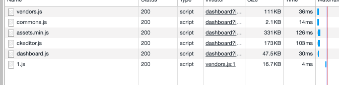

## 타입스크립트 컴파일 및 실행

**TS**

1. 타입스크립트 소스 → 타입스크립트 AST
2. 타입 검사기가 AST를 확인
3. 타입스크립트 AST → 자바스크립트 소스

**JS**

1. 자바스크립트 소스 → 자바스크립트 AST
2. AST → 바이트 코드
3. 런타임이 바이트코드를 평가

## 자바스크립트와 타입스크립트 타입 시스템 비교

| 타입 시스템 기능            | 자바스크립트   | 타입스크립트        |
| --------------------------- | -------------- | ------------------- |
| 타입 결정 방식              | 동적           | 정적                |
| 타입이 자동으로 변환되는가? | ⭕️            | ❌(대부분)          |
| 언제 타입을 확인하는가?     | 런타임         | 컴파일 타임         |
| 언제 에러를 검출하는가?     | 런타임(대부분) | 컴파일 타임(대부분) |

## tsconfig.json

모든 타입스크립트 프로젝트는 루트 디렉터리에 tsconfig.json이라는 파일이 존재해야 한다. tsconfig.json 파일은 타입스크립트의 프로젝트에서 어떤 파일을 컴파일하고, 어떤 자바스크립트 버전으로 방출하는지 등을 정의한다.

| 옵션    | 설명                                                                                                                       |
| ------- | -------------------------------------------------------------------------------------------------------------------------- |
| include | TSC가 타입스크립트 파일을 찾을 디렉터리                                                                                    |
| lib     | TSC가 코드 실행 환경에서 이용할 수 있다고 가정하는 API                                                                     |
| module  | TSC가 코드를 컴파일할 대상 모듈 시스템 (CommonJS, SystemJS, ES2015 등)                                                     |
| outDir  | 생성된 자바스크립트 코드를 출력할 디렉터리                                                                                 |
| strict  | 유효하지 않은 코드를 확인할 때 가능한 한 엄격하게 검사. 이 옵션을 이용하면 코드가 적절하게 타입을 갖추도록 강제할 수 있다. |
| target  | TSC가 코드를 컴파일할 자바스크립트 버전 (ES3, ES5, ES2015, ES2016 등)                                                      |

## 타입

### any

뭐든지 할 수 있지만 꼭 필요한 상황이 아니라면 사용하지 않는 것이 좋다. 타입스크립트에서는 컴파일 타임에 모두가 타입이 있어야 하므로 프로그래머와 타입스크립트 둘 다 타입을 알 수 없는 상황에서는 기본 타입인 any라고 가정한다.

### unknown

타입을 미리 알 수 없는 어떤 값이 있을 때 any 대신 unknown을 사용하자.

any처럼 unknown도 모든 값을 대표하지만, unknown의 타입을 검사해 정제하기 전까지는 타입스크립트가 unknown 타입의 값을 사용할 수 없게 강제한다.

```tsx
let a: unknown = 30; // unknown
let b = a === 123; // boolean
let c = a + 10; // 에러 TS2571: 객체의 타입이 'unknown'임
if (typeof a === 'number') {
  let d = a + 10; // number
}
```

- a : unknown 타입을 사용하고자 한다면 개발자가 명시적으로 설정
- b : unknown 타입이 아닌 값과 unknown 타입인 값을 비교할 수 있다.
- c : unknown 값이 특정 타입이라고 가정하고 해당 타입에서 지원하는 동작을 수행할 수 없다.
- d : 먼저 타입스크립트에게 해당 값이 특정 타입임을 증명해야 한다.

### 타입 리터럴 (type literal)

오직 하나의 값을 나타내는 타입

```tsx
let e: true = true; // boolean 타입이 가질 수 있는 값 중 특정한 하나의 값으로 한정
```

### 객체

타입스크립트의 객체 타입은 객체의 형태를 정의한다.

```tsx
let a: {
  b: number;
  c?: string;
  [key: number]: boolean;
};

a = { b: 1, c: 'd', 10: true };
```

- a는 number 타입의 프로퍼티 b를 포함한다.
- a는 string 타입의 프로퍼티 c를 포함할 수도 있다.
- a는 boolean 타입의 값을 갖는 number 타입의 프로퍼티를 여러 개를 포함할 수 있다.

### 인덱스 시그니처 (index signature)

`[key: T] : U` 같은 문법을 인덱스 시그니처라고 부르며 어떤 객체가 여러 키를 가질 수 있음을 알려준다.

인덱스 시그니처의 키 이름은 원하는 이름을 가져다 바꿔도 된다.

```tsx
let airplaneSeatingAssignments: {
  [seatNumber: string]: string;
} = {
  '34D': 'Boris Cherny',
  '34E': 'Bill Gates',
};
```

### 타입 별칭

(let, const, var) 변수를 선언해서 값 대신 변수로 칭하듯이 타입 별칭으로 타입을 가리킬 수 있다.

```tsx
type Age = number;
type Person = {
  name: string;
  age: Age;
};

let age: Age = 55;
let driver: Person = {
  name: 'James May',
  age: age,
};
```

하나의 타입을 두번 정의할 수는 없다.

```tsx
type Color = 'red';
type Color = 'blue'; // Error
```

### 유니온과 인터섹션 타입

- 유니온 : 합집합
- 인터섹션 : 교집합

```tsx
type Cat = { name: string; purrs: boolean };
type Dog = { name: string; bark; boolean };

type CatOrDogOrBoth = Cat | Dog;
type CatAndDog = Cat & Dog;

let a: CatOrDogOrBoth = {
  name: 'Bonkers',
  purrs: true,
};

let a: CatOrDogOrBoth = {
  name: 'Bonkers',
  bark: true,
};

let a: CatOrDogOrBoth = {
  name: 'Bonkers',
  purrs: true,
  bark: true,
};

let b: CatAndDog = {
  name: 'Bonkers',
  purrs: true,
  bark: true,
};
```

### 배열

타입스크립트는 T[ ]와 Array<T> 라는 두 가지 배열 문법을 지원한다.

```tsx
let a: number[] = [1, 2, 3];
let b: string[] = ['a', 'b'];
let c: (string | number)[] = [1, 'a'];
```

### 튜플

다른 타입과 달리 튜플은 선언할 때 타입을 명시해야 한다.

```tsx
let a: [string, number] = ['Ted', 123];
let b: [string, number?][] = [['Ted', 123], ['Maeng']];
let b: ([string] | [string, number])[] = [['Ted', 123], ['Maeng']];
```

⇒ ? : 선택형

최소 길이를 갖도록 지정할 때는 나머지 요소(...)를 사용할 수 있다.

```tsx
let friends: [string, ...string[]] = ['Sara', 'Tali', 'Chloe'];
let list: [number, boolean, ...string[]] = [1, false, 'a', 'b', 'c'];
```

<br/>

### 무언가가 없음을 의미하는 타입

---

| 타입      | 의미                           |
| --------- | ------------------------------ |
| null      | 값이 없음                      |
| undefined | 아직 값을 변수에 할당하지 않음 |
| void      | return문을 포함하지 않는 함수  |
| never     | 절대 반환하지 않는 함수        |

<br/>

### enum

TypeScript enum은 JavaScript에는 없는 개념으로, 일견 상수, 배열, 혹은 객체와 비슷해보인다.

그냥 상수, 배열, 객체를 써도 될 것 같은데, 굳이 enum을 쓰는 이유가 무엇일까?

1. 객체는 속성을 자유로이 변경할 수 있지만, **enum의 속성은 변경할 수 없다**.
2. 객체의 속성은 리터럴의 타입이 아니라 그보다 넓은 타입으로 타입 추론이 이루어지만, enum은 **항상 리터럴 타입이 사용된다.**
3. 객체의 속성 값으로는 JavaScript가 허용하는 모든 값이 올 수 있지만, **enum의 속성 값으로는 문자열 또는 숫자만 허용됩니다.**

```tsx
type LanguageCode = 'ko' | 'en' | 'ja' | 'zh' | 'es';
const code: LanguageCode = 'ko';

/*
	제품이 어떤 언어를 지원하기로 했었는지도 가물가물하고,
	특정 국가 코드가 정확히 어떤 언어를 가리키는지 일일이 외우기도 쉽지 않다.
*/

enum LanguageCode {
  korean = 'ko',
  english = 'en',
  japanese = 'ja',
  chinese = 'zh',
  spanish = 'es',
}

const code: LanguageCode = LanguageCode.korean;
```

⇒ 열거형을 안전하게 사용하는 방법은 까다로우므로 열거형 자체를 멀리 할 것을 권한다.

## 함수

```tsx
const add = (a: number, b: number): number => {
  return a + b;
};
```

실무에서는 타입스크립트가 반환 타입을 추론하도록 하는 게 보통이다. 타입스크립트가 해줄 수 있는 일을 개발자가 직접 할 필요가 없기 때문이다.

```tsx
type Context = {
  appId?: string;
  userId?: string;
};

const log = (message: string, context: Context = {}) => {
  let time = new Date().toISOString();
  console.log(time, message, context.userId);
};
```

보통 실무에서는 선택적 매개변수보다 기본(default) 매개변수를 더 자주 사용하게 된다.

### 나머지 매개변수

인수를 여러 개 받는 함수라면 그 목록을 배열 형태로 건넬 수 있다.

```tsx
const sum = (numbers: number[]): number => {
  return numbers.reduce((total, n) => total + n, 0);
};

sum([1, 2, 3]);

const sum = (...numbers: number[]): number => {
  return numbers.reduce((total, n) => total + n, 0);
};

sum(1, 2, 3);
```

### 제너레이터 함수

```tsx
function* generator(i: number): IterableIterator<number> {
  yield i + 10;
  yield i + 20;
  yield i + 30;
}

const gen = generator(10);

console.log(gen.next().value);
// expected output: 20

console.log(gen.next().value);
// expected output: 30

console.log(gen.next().value);
// expected output: 40

console.log(gen.next().value);
// expected output: undefined
```

- 함수명 앞에 \*를 붙이면 제너레이터임을 의미한다.
- 제너레이터를 호출하면 이터러블 반복자가 반환된다.
- `.next()` 메소드를 이용하면 결과를 소비자에게 보여주고, 소비자가 다음 값을 다시 요청하기 전까지는 실행을 중지한다.

### 호출 시그니처

```tsx
type Sum = (a: number, b: number) => number

const sum: Sum = (a b) {
	return a + b
}
```

- 매개변수의 타입을 다시 지정할 필요는 없다. Sum에서 a와 b의 타입을 number로 이미 명시했으므로 다시 지정할 필요는 없다.
- 반환 타입도 Sum에서 이미 명시했으므로, 다시 지정할 필요없다.

### 제네릭

여러 장소에 타입 수준의 제한을 적용할 때 사용하는 플레이스홀더 타입(Placeholder type)

다형성 타입 매개변수(Polymorphic type parameter)라고도 부른다.

보통, **함수에서 함수를 호출할 때**, **클래스를 인스턴스화 할 때** 사용한다.

```tsx
// 함수 선언시 타입 지정 필요.
type Sum<T> = (a: T, b: T) => T;

const sum1: Sum<number> = (a, b) => {
  return a + b;
};

const sum2: Sum<string> = (a, b) => {
  return a + b;
};

sum1(1, 3); // 4
sum2('1', '3'); // '13'
```

```tsx
// 함수 호출시 타입스크립트가 T 타입 추론
type First = <T>(a: T, b: T) => T;

const first: First = (a, b) => {
  return a;
};

first(1, 3); // 1
first('1', '3'); // '1'
```

- 꺽쇠괄호(<>)로 제네릭 타입 매개변수임을 선언한다.
- 꺽쇠 기호를 추가하는 위치에 따라 제네릭의 범위가 결정된다.
- T는 단지 타입 이름으로 T대신 A, Zebra 등 원하는 이름 어떤 것이든 사용할 수 있다.

**두 가지 제네릭 타입 사용**

```tsx
type Second = <T, U>(a: T, b: U) => U

const second:Second = (a, b) => {
  return b
}

second(1, '3') // '3'
second('1', 3)) // 3
```

### Promise의 제네릭 타입 매개변수

```tsx
let promise = new Promise((resolve) => resolve(45));
promise.then((result) => result * 4); // result를 {}로 추론
```

```tsx
let promise = new Promise<number>((resolve) => resolve(45));
promise.then((result) => result * 4); // result를 number로 추론
```

## 클래스

### 접근제한자

- **public**
  어디에서나 접근할 수 있다. 기본적으로 주어지는 접근 수준이다.
- **protected**
  이 클래스와 서브클래스에서만 접근할 수 있다.
- **private**
  이 클래스에서만 접근할 수 있다.

```tsx
class Person {
  private name: string;
  protected pName: string;

  constructor(name: string) {
    this.name = name;
    this.pName = name;
  }

  greet(): string {
    return 'Hello, ' + this.name;
  }
}

class SalesMan extends Person {
  greet(): string {
    return 'Hello, i am salesMan, ' + this.name; // 오류 발생
  }
  greetP(): string {
    return 'Hello, i am salesMan, ' + this.pName; // 참조 가능
  }
  constructor(name: string) {
    super(name);
  }
  work() {
    console.log('I am working');
  }
}

let ash = new SalesMan('ash');
ash.pName; // 오류 발생
ash.name; // 오류 발생
```

### 추상 클래스

구체적인 구현이 없어야 하고 반드시 상속받는 클래스에서 구현해야 한다.

```tsx
abstract class Person {
  constructor(public name: string) {}
  abstract eat(); // 반드시 오버라이딩 해야한다.
}

class Developer extends Person {
  constructor(name: string) {
    super(name);
  }
  eat() {
    console.log('냠냠냠');
  }
}

class SalesMan extends Person {
  // 오류 발생!
  constructor(name: string) {
    super(name);
  }
}

let ash = new Person('ash'); // 오류 발생!
let devAsh = new Developer('ash');
devAsh.eat(); // 냠냠
```

### 인터페이스

타입처럼 인터페이스도 타입에 이름을 지어주는 수단이므로 인터페이스를 사용하면 타입을 더 깔끔하게 정의할 수 있다. 타입 별칭과 인터페이스는 문법만 다를 뿐 거의 같은 기능을 수행한다.

```tsx
type Food = {
  calories: number;
  tasty: boolean;
};

type Sushi = Food & {
  salty: boolean;
};

interface Food {
  calories: number;
  tasty: boolean;
}

interface Sushi extends Food {
  salty: boolean;
}
```

### 인터페이스 vs 타입

1. 타입 별칭은 더 일반적이어서 타입 별칭의 오른편에는 타입표현식(타입 그리고, &, | 등의 타입 연산자)을 포함한 모든 타입이 등장할 수 있다. 반면 인터페이스 오른편에는 반드시 형태가 나와야 한다. 예를 들면 다음과 같은 타입 별칭 코드는 인터페이스로 다시 작성할 수 없다.

   ```tsx
   type A = number;
   type B = A | string;
   ```

2. 인터페이스를 상속할 때 타입스크립트는 상속받는 인터페이스의 타입에 상위 인터페이스를 할당할 수 있는지를 확인한다.

   ```tsx
   interface A {
     good(x: number): string;
     bad(x: number): string;
   }

   interface B extends A {
     good(x: string | number): string;
     bad(x: string): string; // 에러 인터페이스 'B'는 인터페이스 'A'를 올바르게 상속받지 않음.
   }

   type A = {
     good(x: number): string;
     bad(x: number): string;
   };

   type B = A & {
     good(x: string | number): string;
     bad(x: string): string; // 에러가 발생하지 않는다.
   };
   ```

   타입 별칭은 확장하는 타입을 최대한 조합하는 방향으로 동작한다. 컴파일 에러가 발생하지 않고 bad를 오버로드한 시그니처가 만들어진다.

3. 인터페이스는 이름과 범위가 같은 인터페이스가 여러 개 있다면 이들이 자동으로 합쳐진다.

   ```tsx
   interface User {
   	name: string
   }

   interface User {
   	age: number
   }

   let a: User = {
   	name: 'Ashley'
   	age: 30
   }
   ```

   ```tsx
   type User = {
     // 에러
     name: string;
   };

   type User = {
     // 에러
     age: number;
   };
   ```

   그러나, 인터페이스끼리는 충돌해서는 안된다.

   ```tsx
   interface User {
     age: string;
   }

   interface User {
     // 에러
     age: number;
   }
   ```

   ### 구현 (implements)

   클래스를 선언할 때 implements라는 키워드를 이용해 특정 인터페이스를 만족시킴을 표현할 수 있다.

   ```tsx
   interface Animal {
     readonly name: string;
     eat(food: string): void;
     sleep(hours: number): void;
   }

   interface Feline {
     meow(): void;
   }

   class Cat implements Animal, Feline {
     eat(food: string) {
       console.info('Ate some', food, '.Mnn!');
     }
     sleep(hours: number) {
       console.info('Slept for', hours, 'hours');
     }
     meow() {
       console.info('Meow');
     }
   }
   ```

   - 인터페이스에서 선언하는 모든 메서드를 구현해야한다.
   - 필요하다면, 메서드나 프로퍼티를 추가로 구현할 수 있다.

   ### 인터페이스 구현 vs 추상클래스 상속

   인터페이스 구현은 추상 클래스 상속과 아주 비슷하다. 하지만 인터페이스가 더 범용으로 쓰이며 가벼운 반면, 추상클래스는 특별한 목적과 풍부한 기능을 갖는다.

   - 인터페이스는 형태를 정의하는 수단이다.
     ⇒ **아무런 자바스크립트 코드를 만들지 않으며 컴파일 타임에만 의존한다.**
   - 추상클래스는 생성자와 기본 구현을 가질 수 있고, 프로퍼티, 메서드에 접근 한정자를 지정할 수 있다.
   - 여러 클래스에서 공유하는 구현은 추상클래스 사용
   - 가볍게 이클래스는 T다 라고 말하는 것이 목적이라면 인터페이스 사용

   ## 네임스페이스와 모듈

   ### import와 export

   타입스크립트는 다른 코드와 마찬가지로 해당 이름을 실제로 사용하는 순간 타입을 의미하는지 값을 의미하는지 추론한다.

   ```tsx
   // a.ts
   export let X = 3;
   export type X = { y: string };

   // b.ts
   import { X } from './a';

   let a = X + 1; // X는 값 X를 가리킴
   let b: X = { y: 'z' }; // X는 타입 X를 가리킴
   ```

   ### 동적 임포트

   큰 파일 하나에 모든 코드를 넣지 말고 자바스크립트 파일을 여러 개 생성하여 나누어 저장하면 여러 조각을 병렬로 로딩할 수 있으므로 용량이 큰 네트워크 요청을 더 수월하게 처리할 수 있다.

   

   ```tsx
   let locale = await import('locale_use-en');
   ```

   타입스크립트는 `esnext` 모듈 모드에서만 동적 임포트를 지원한다. 동적 임포트를 사용하려면 tsconfig.json의 `compilerOptions`에서 `{"module": "esnext"}`를 설정한다.

   ### 엠비언트 선언

   기존 자바스크립트 모듈을 타입스크립트에서 사용하기 용이하도록 기존 자바스크립트 모듈의 타입정보를 별도의 파일로 선언

   **타입 선언 파일 활용**

   1. 다른 사용자가 타입스크립트 응용 프로그램에서 여러분이 만든 컴파일한 타입스크립트를 사용한다면 그들의 TSC 인스턴스는 여러분의 타입스크립트로부터 생성된 자바스크립트 파일에 대응하는 .d.ts 파일을 검색한다. 그 결과 타입스크립타가 여러분의 프로젝트에 사용된 타입을 알 수 있다.
   2. (VSCode 등) 타입스크립트를 지원하는 코드 편집기는 이 .d.ts 파일들을 읽어 해석한 다음 여러분이 코드를 작성할 때 (심지어 타입스크립트 코드가 아니더라도) 유용한 타입 힌트를 제공한다.
   3. 타입 스크립트 코드의 불필요한 재컴파일을 막아주어 컴파일 시간을 크게 줄여준다.

   **이미 존재하는 .d.ts 가져다 쓰기**

   - npm install module-name
   - npm install @types/module-name
     ⇒ 타입 선언만 포함하는 모듈

   **프로젝트 내 .d.ts 선언**

   1. 라이브러리내 @types 폴더를 만든다.
   2. tsconfig.json에 typeRoots를 지정해준다.

      "typeRoots":["./node_modules/@types", "./@types"]

   3. @types 안에 해당 모듈명의 디렉토리 생성
   4. 생성한 디렉토리 안에 index.d.ts 생성
   5. export 할 타입의 인터페이스 선언

   **예시)**

   ```tsx
   // /src/@types/Foo/index.d.ts
   declare module 'myModule' {
     export namespace myNamespace {
       type Foo = string;
       interface Bar {
         baz: number;
       }
     }
   }
   ```

   ```tsx
   import { myNamespace } from 'myModule';

   const foo: myNamespace.Foo = 'foo';
   console.log(foo);
   ```
